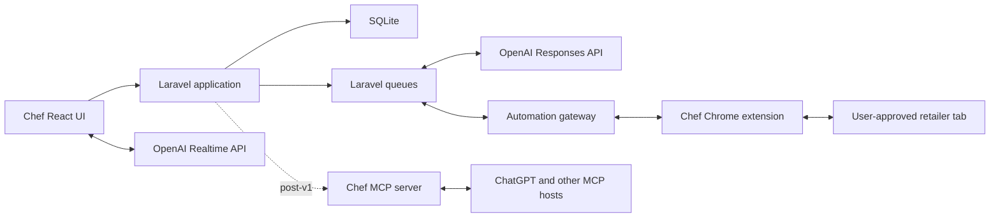

# Chef

Chef is a voice-first household meal-planning and grocery-management application.

The primary experience is a natural-language conversation: plan a week, explore ideas, negotiate preferences, adjust the budget, and ask the assistant to prepare an order. The application UI supports that conversation with durable structure and fast navigation when conversation is not the best interface—especially while reviewing the week, shopping, or cooking dinner.

Chef is not intended to be another recipe catalogue with an AI chat box attached. The household's plans, recipes, preferences, feedback, product choices, and order history are first-class application data. AI operates that model through explicit tools; it is not the system of record.

## Status

Milestones 0 through 6 are complete. The Laravel 13 web application under
[`web/`](web/) now supports authenticated family tenancy, a durable
conversational first plan, household people and attributed truth, versioned
recipes, complete arbitrary-span plans, direct plan controls, and private
testing feedback. The M4/M4.1 shopping journey automatically turns selected
cookable meals into durable recipe versions, combines their ingredients into a
traceable list, and continues the same natural conversation for pantry,
household-item, quantity, and budget changes. Progressive preparation and
recovery states keep manual ingredient entry out of the normal path. M5 adds a
Today surface, focused step-by-step cooking with durable progress and timers,
meal outcomes, person-specific feedback, and inspectable preference candidates
that can never become safety rules. M6 adds a permissioned Woolworths and Coles
cart-preparation handoff with frozen list scope, explicit approvals,
reconciliation, pause and takeover controls, and a hard human boundary before
checkout. Account-backed retailer acceptance is deferred to the version 1
production-like release gates. M7 native voice is the next product milestone.

The intended stack is:

- Laravel
- SQLite
- Inertia
- React and TypeScript
- Tailwind CSS
- shadcn/ui
- Pest
- Laravel AI SDK with the OpenAI provider for ordinary planning agents
- A Chef-owned OpenAI Responses API client for native computer-use agents
- OpenAI Realtime API for native voice conversation
- A permissioned Chef Chrome extension for local browser execution
- A post-v1 MCP server exposing reviewed Chef domain capabilities to authorised external agents

## Product thesis

Weekly food planning is not fundamentally a data-entry problem. It is a recurring household conversation:

- What do we feel like eating?
- What does everyone tolerate, dislike, or love?
- How much time and money do we have this week?
- What ingredients can be reused?
- What is already in the pantry?
- What did we cook recently?
- What needs to be ordered?
- What are we actually cooking tonight?

Chef should make that conversation enjoyable, remember its outcomes, and turn them into an executable plan.

## Household personas

Chef supports roles rather than assuming one permanent "meal planner."

### The planner

Usually plans several days at once, often through voice. They want inspiration without losing control of constraints, costs, or household preferences.

### The participant

Contributes preferences, rejects ideas, requests favourites, and may add household staples. They should not need to understand recipes or maintain structured data.

### The shopper

Needs one consolidated, editable list with quantities, preferred products, price context, substitutions, and a safe handoff to a supermarket trolley.

### The cook

Needs immediate access to tonight's meal, preparation warnings, ingredients, equipment, and readable step-by-step instructions. They should not have to reconstruct Sunday's planning conversation.

One person may occupy every role in a week. Different household members may also share them.

## Onboarding is the first meal plan

Onboarding should not feel like account administration followed by the real product. It should be the household's first planning conversation and the first useful thing they accomplish in Chef.

After the minimum account setup, Chef opens the same conversational workspace used for ordinary planning and says, in effect:

> Let's plan your first few meals. I'll learn what matters to your household as we go, and you can correct anything I remember.

The assistant gathers context naturally while building a real `MealPlan`. Structured controls—chips, meal cards, checkboxes, small forms, and the plan inspector—appear inside or beside the conversation only when they are faster than another message. The person can speak, type, skip a question, revise an earlier answer, or say that they do not know yet.

This approach has three benefits:

- the household receives value before onboarding is complete;
- the onboarding interaction teaches the normal Chef interaction model;
- preferences are learned in context rather than collected as an abstract questionnaire.

### What Chef needs to learn

Chef should progressively establish a baseline across five areas.

#### Household

- household and member names;
- default participants and approximate serving needs;
- timezone;
- which meals are normally planned;
- whether participation varies by day or meal.

Household size alone is insufficient. Participation and servings belong to each meal slot so a household can say, for example, that Thursday dinner is for one person while the rest of the plan is for two.

#### Safety and non-negotiables

- allergies and their severity;
- intolerances;
- religious, ethical, or medical restrictions;
- hard ingredient or meal exclusions;
- cross-contamination requirements where relevant.

Chef must clearly distinguish safety constraints from dislikes and soft preferences. It must never infer an allergy from rejected suggestions or meal feedback.

#### Taste baseline

- meals and cuisines the household loves;
- disliked meals, ingredients, textures, and preparation styles;
- preferred spice level;
- appetite for novelty versus familiar favourites;
- a few representative meals regularly cooked or ordered.

Rather than asking for exhaustive lists, Chef can show a small set of varied meal cards and ask the household to react. People can also paste a recipe URL, attach a screenshot, import a previous plan, or describe a typical week.

#### Cooking reality and goals

- realistic weeknight and weekend cooking time;
- cooking confidence and available equipment;
- willingness to prepare leftovers or repeat meals;
- whether leftovers should become lunches;
- expected eating-out nights;
- goals such as lower cost, higher protein, less waste, easier evenings, or greater variety;
- a default grocery budget range, with per-plan overrides.

#### Shopping preferences

- preferred retailer and fallback retailer;
- delivery, click-and-collect, or in-store preference;
- value, brand, pack-size, and substitution preferences;
- whether the household is willing to split a shop across retailers;
- common staples and products worth remembering.

### Progressive onboarding sequence

The first conversation should ask only enough to make safe, plausible recommendations:

1. Who are we planning for?
2. Are there any allergies, intolerances, or absolute exclusions?
3. What are several meals you genuinely enjoy?
4. What ingredients or meals should Chef avoid?
5. How much time is realistic on an ordinary evening?
6. How should leftovers and lunches work?
7. What grocery budget feels normal?
8. Where do you usually shop?

Chef then proposes a small first plan. The household's reactions provide further preference evidence, and the assistant can ask one contextual follow-up at a time. Before confirmation, Chef shows an editable summary of what it learned, explicitly separating safety rules, stated preferences, defaults, and tentative inferences.

Onboarding is therefore progressively complete rather than permanently blocking. Missing optional information can be collected when it becomes relevant in later plans.

### Onboarding interface

The onboarding experience uses the standard Chef shell:

- the conversation occupies the main workspace;
- a lightweight progress indicator communicates what remains without presenting a wizard;
- the right-hand inspector fills with household members, constraints, preferences, budget, shopping defaults, and the developing meal plan;
- interactive meal cards and quick-reaction controls make comparison fast;
- every remembered fact is editable or removable;
- the composer supports text, attachments, and voice;
- completion lands directly in the first plan rather than redirecting to an empty dashboard.

The experience must remain useful with typing alone. Voice is a first-class input, not a requirement.

### Permissions are requested just in time

Chef should explain each permission in plain language and ask only when the corresponding capability is first used:

- microphone access when the person first taps voice;
- notifications when enabling meal, preparation, shopping, or automation alerts;
- calendar read or write access when connecting schedules or creating reminders;
- camera or photo access when scanning a pantry, receipt, or recipe;
- retailer-tab access when preparing the first online cart;
- location only when it is needed to select a store or resolve delivery availability.

Every permission should have a visible status, scope, and revocation path. Declining an optional permission must preserve a manual alternative.

## The four-stage experience

### 1. Plan — converse and explore

**Intent:** Decide what the household might eat over a date range.

The conversation is the primary interface. A person can say:

> Plan seven dinners for two people. Keep weeknights under 45 minutes, give us one slow-cooker meal, avoid recent repeats, and try to stay near $180.

Chef should bring relevant context into the conversation:

- household likes, dislikes, exclusions, and dietary requirements;
- recently cooked meals and prior ratings;
- time, budget, serving, and nutrition goals;
- pantry items and likely leftovers;
- reusable ingredients and preferred products;
- calendar constraints when explicitly connected.

The assistant should propose a coherent week, explain trade-offs, accept loosely worded changes, and avoid treating early ideas as commitments.

**Supporting UI:** A live week preview beside the conversation, showing draft meals, estimated cost, effort, repeated ingredients, and unresolved questions.

**Exit condition:** The household confirms a meal plan.

### 2. Review — make the week concrete

**Intent:** Turn an agreed direction into a reliable plan.

The application becomes more prominent here. People should be able to:

- scan the whole week;
- drag meals between days;
- adjust servings;
- mark eating out, leftovers, or an unplanned night;
- open the exact recipe version attached to a meal;
- see preparation requirements such as defrosting or marinating;
- identify ingredient overlap and likely waste;
- swap a meal conversationally or directly in the UI.

The UI is authoritative, while natural language remains available for broad changes such as "move the slow-cooker meal to Saturday and make Wednesday easier."

**Exit condition:** Every planned meal has a day, serving count, and usable recipe or explicit non-recipe status.

### 3. Shop — consolidate, budget, and order

**Intent:** Convert the plan into the products the household needs.

Chef should:

- aggregate and normalise recipe ingredients;
- subtract confirmed pantry stock;
- keep household staples alongside recipe-derived items;
- distinguish an ingredient requirement from a retailer product;
- remember preferred brands, pack sizes, and acceptable substitutes;
- estimate the order and compare it with the weekly budget;
- preserve actual order prices for historical reporting;
- prepare an online trolley through a retailer integration or computer use.

Computer use is a retailer adapter, not the source of truth. Chef owns the intended shopping list and records what was ultimately ordered. Browser automation may prepare a trolley, but checkout and payment always remain an explicit human action.

**Supporting UI:** A source-attributed shopping list, budget summary, product matches, substitution preferences, pantry exclusions, and order-review state. Retailer-backed aisle grouping and rejected-product history arrive with catalogue discovery and reconciliation in the retailer-handoff milestone.

**Exit condition:** The shopping list is completed in store or reconciled with a reviewed retailer order.

### 4. Cook and learn — execute tonight, then improve

**Intent:** Make the plan useful at dinner time and improve the next plan.

The default screen should answer "what are we cooking tonight?" immediately. It should show:

- the meal and expected serving time;
- defrosting, marinating, or prep warnings;
- ingredients with quantities;
- equipment;
- large, sequential cooking steps;
- timers or concurrent tasks where useful;
- substitutions made during shopping;
- leftover and storage guidance.

Afterward, feedback should be lightweight and person-specific:

- cooked, skipped, replaced, or postponed;
- like, dislike, favourite, or neutral;
- what specifically worked or did not;
- whether the portion, effort, cost, and leftovers were appropriate;
- recipe adjustments to keep next time.

Feedback must update structured household knowledge rather than disappearing into chat history.

**Exit condition:** The meal outcome is recorded with as little or as much feedback as the household wants to provide.

## Experience principles

### Conversation first, UI when it is faster

Planning and changing intent should feel conversational. Comparing several days, checking a list, and following a recipe should feel visual and immediate.

### Household memory must be inspectable

People can see, correct, scope, or delete remembered preferences. Chef should distinguish explicit rules from inferred patterns and retain the evidence behind an inference.

### Preferences belong to people

Household consensus is not assumed. A meal can be loved by one person and merely tolerated by another. Hard exclusions, soft dislikes, favourites, and context-specific opinions are different concepts.

### Plans are date ranges, not just ISO weeks

The common case is a week, but the model should support weekends, partial weeks, holidays, and custom spans without inventing fake days.

### Ingredients are not supermarket products

"Chicken breast, 1 kg" is a culinary requirement. A specific Coles product, pack size, price, and substitution policy is a retail decision. Chef must model and reconcile both.

### External side effects are reviewable

Chef may propose changes and prepare carts. Sending orders, paying, deleting meaningful history, or sharing household data requires an explicit review or confirmation boundary.

### Recommendations should be explainable

Chef should be able to say why a meal was suggested: it fits the time available, uses an open ingredient, has not been cooked recently, suits both people, and keeps the projected shop within budget.

## Core domain model

The names are provisional, but the boundaries are intentional.

### Team, household, and people

- `Team`, presented as a family or household in the interface
- `User`
- `TeamMembership`
- `TeamInvitation`
- `Person`
- `UserPersonLink`
- `Preference`
- `PreferenceEvidence`

A team is Chef's tenancy and collaboration boundary. A user may belong to multiple teams, while a person may participate in meals and hold preferences without having an account. A preference may target an ingredient, recipe, meal, cuisine, retailer product, brand, preparation method, or freeform concept. It records strength, sentiment, provenance, confidence, and optional context.

### Planning

- `MealPlan` with `starts_on`, `ends_on`, lifecycle milestones, and a conversation thread
- `MealSlot` for a dated breakfast, lunch, dinner, snack, or custom occasion
- `PlannedMeal` with servings, status, notes, and an optional recipe version

A planned meal may represent a recipe, leftovers, takeaway, eating out, or an intentionally open slot.

### Recipes

- `Recipe`
- `RecipeVersion`
- `RecipeIngredient`
- `RecipeStep`
- `Ingredient`
- `Unit`

Recipe versions preserve what was actually planned and cooked even after the household improves the recipe.

### Pantry and shopping

- `PantryItem`
- `ShoppingList`
- `ShoppingListItem`
- `Retailer`
- `RetailProduct`
- `ProductMatch`
- `ProductPreference`

Shopping-list items retain their source: recipe requirement, staple, manual request, or assistant recommendation.

### Orders and budgets

- `Budget`
- `Order`
- `OrderLine`
- `OrderAdjustment`

Order lines store product descriptions, quantities, prices, substitutions, and retailer identifiers as historical snapshots. Past spending should never change because today's catalogue changed.

### Outcomes and learning

- `MealOutcome`
- `MealFeedback`
- `RecipeAdjustment`

Feedback belongs to a person and a specific meal occurrence. Chef may derive preference candidates from repeated outcomes, but inferred preferences remain distinguishable from explicit ones.

### Conversations, permissions, and automation

- `Conversation`
- `Message`
- `ConsentGrant`
- `AutomationRun`
- `AutomationStep`
- `AutomationApproval`
- `BrowserConnection`

An automation run records its requested scope, shopping-list revision, retailer, execution surface, status, audit references, unresolved decisions, approvals, and final reconciliation. Sensitive screenshots should have an explicit retention policy rather than becoming permanent household history by default.

## Application architecture

Chef should remain one Laravel application rather than prematurely splitting into an API backend and detached SPA.

- Laravel owns authentication, authorisation, domain workflows, persistence, queues, and integrations.
- SQLite is the initial database and should remain viable for a personal or single-household installation.
- Inertia is the bridge between Laravel and React.
- React and shadcn/ui provide the conversational workspace, weekly planner, shopping review, and cooking mode.
- The OpenAI Responses API provides the primary planning, tool-use, and computer-use agent loop.
- The OpenAI Realtime API provides low-latency speech through WebRTC; Laravel creates the session or short-lived client credential so a permanent API key is never exposed to the browser.
- Server-sent events or WebSockets stream assistant and automation progress without making the entire application a detached client-side API product.
- A permissioned Chef Chrome extension executes computer actions in a user-approved retailer tab and returns screenshots or action results.
- An automation gateway connects queued Laravel work to the active extension. It may begin inside Laravel and be extracted into a small TypeScript service only when long-running sessions justify it.
- Domain actions should remain reusable from HTTP controllers, queued jobs,
  console commands, and future MCP tools.



The architectural boundary is intentional:

- Chef's domain determines what the household intends to plan, buy, cook, and remember.
- OpenAI models reason about the next useful action and invoke explicit Chef or computer tools.
- The execution harness supplies tightly scoped screenshots, mouse, keyboard, and browser actions.

The model does not directly control a person's computer. It returns actions for Chef's harness to validate and execute.

### Local browser execution

A normal web application cannot control arbitrary supermarket tabs. For the preferred local experience, the household installs the Chef Chrome extension and explicitly grants a shopping run access to a selected tab.

The extension should:

- activate only for an initiated automation run;
- limit access to the selected tab and approved retailer origins;
- show an unmistakable control indicator;
- execute validated click, type, scroll, navigation, and screenshot requests;
- support immediate pause, cancellation, and manual takeover;
- avoid broad filesystem, extension, or unrelated browsing access;
- release control automatically when the run finishes or expires.

A managed, isolated cloud browser can be added later behind the same automation gateway for asynchronous runs. It is a second execution surface, not a different meal-planning architecture.

### Computer-use lifecycle

When a household approves a shopping list for cart preparation:

1. Chef freezes the shopping-list revision used by the run.
2. Laravel creates a scoped `AutomationRun` and dispatches it to a queue.
3. The Responses API examines the current screenshot and returns structured computer actions.
4. Chef validates the actions against retailer, tab, and risk policy.
5. The extension executes allowed actions and returns the updated screen.
6. The loop continues until the cart is prepared, a decision requires approval, or the run fails safely.
7. Chef presents products, substitutions, unresolved items, estimated total, and material differences for review.
8. The person takes over for checkout and payment.

Page content, retailer messages, advertisements, and on-screen instructions are untrusted input. They cannot expand an automation run's permission or override household intent.

### Approval boundaries

Chef may automatically search, compare, and add ordinary products after the person starts a scoped cart-preparation run. It should pause immediately before:

- a material substitution outside the household's stated policy;
- exceeding the approved budget or tolerance;
- changing the selected store, delivery address, or fulfilment method;
- transmitting sensitive personal information;
- responding to authentication, bot-detection, or suspicious instructions;
- selecting a consequential delivery window;
- placing an order or initiating payment.

Checkout, payment details, and final order submission always remain under direct human control.

## OpenAI and post-v1 MCP boundary

Chef is OpenAI-native: its own conversational interface uses the OpenAI
Responses and Realtime APIs. MCP is deferred until after version 1 because the
standalone household product does not depend on external-agent access. A future
MCP server remains an additional interface to the same Laravel domain actions,
allowing a household to work with Chef from ChatGPT or another authorised MCP
host. It will not replace Chef or its system of record.

Post-v1 MCP capabilities should be narrow and composable:

- inspect household context and preferences;
- inspect or create a meal plan;
- suggest, schedule, move, swap, or remove a meal;
- read recipes and cooking steps;
- generate and reconcile a shopping list;
- inspect budget and historical order context;
- record feedback and meal outcomes;
- prepare a retailer-cart handoff;
- record the reviewed result of an order.

Tool responses should return stable identifiers and structured data so an assistant can continue a conversation without scraping the UI. Write tools should be explicit about their side effects and support idempotency where retries are plausible.

Essential household knowledge must never exist only inside OpenAI conversation state. Prompts and model calls operate on durable, inspectable Chef data, and every meaningful write returns stable domain identifiers.

## MVP

The first useful slice should support one family team, multiple collaborating users, and one team timezone. The tenancy model must allow a user to belong to multiple teams even if the first slice exercises only one.

### Included

- household members and explicit preferences;
- family invitations and attributed collaboration;
- conversational first-plan onboarding with an editable household summary;
- recipes, ingredients, steps, and recipe versions;
- arbitrary meal plans and dated dinner slots;
- native typed planning through the OpenAI Responses API;
- voice planning through the OpenAI Realtime API;
- weekly planner UI;
- "Tonight" cooking view;
- consolidated shopping list with manual items;
- estimated and actual order totals;
- meal feedback and recent-meal history;
- a reviewed computer-use handoff for one retailer through the Chef Chrome extension.

### Not initially included

- public recipe discovery or a social network;
- nutrition or medical advice;
- perfect pantry inventory automation;
- autonomous checkout or payment;
- multi-retailer price optimisation;
- native mobile applications;
- complex real-time household collaboration;
- external-agent access through MCP;
- a marketplace of community recipes.

## Proposed delivery sequence

1. **Foundation** — Laravel, Inertia, React, shadcn/ui, SQLite, authentication, tenancy, quality gates, and the application shell.
2. **Conversational onboarding** — The first real meal plan, household people, explicit safety constraints, preferences, invitations, proposals, and an editable learning summary.
3. **Recipes and complete planning** — Recipe versions, imports, richer meal occasions, calendar and list views, revisions, and explainable recommendations.
4. **Shopping and budgets** — Ingredient aggregation, manual staples, pantry exclusions, product matches, list revisions, and order snapshots.
5. **Cooking and feedback** — Tonight view, preparation notices, steps, outcomes, and inspectable preference candidates.
6. **Retailer handoff** — Chrome extension, Responses API computer use, Woolworths and Coles cart preparation, risk-scoped approvals, reconciliation, and human checkout.
7. **Native voice** — Realtime WebRTC input and output over the same durable conversations and domain actions.
8. **Public launch** — Operational, privacy, accessibility, security, recovery, and support gates for version 1.

After version 1, MCP can add read tools followed by reviewed planning, shopping,
and feedback writes for authorised external hosts without changing Chef's domain
model.

## Product questions to resolve during discovery

- Does a household own recipes collectively, or can recipes remain personal and shared selectively?
- How should Chef represent disagreement between household members when ranking meals?
- Which inferred preferences are useful enough to surface without becoming intrusive?
- Is pantry stock manually confirmed, inferred from orders, or both?
- How much product matching should happen before the shopping-review screen?
- Which actions can an assistant take immediately, and which require staged confirmation?
- Which onboarding questions materially improve the first plan, and which should wait until context makes them relevant?
- Which Chrome extension permissions provide the narrowest reliable retailer-tab control?
- When should a managed browser become an alternative to the local extension?
- What is the smallest useful recipe-import workflow?

## Repository layout

Chef is a monorepo so each client can share one product model without forcing the Laravel application to live at the repository root.

```text
web/                 Laravel, Inertia, and React application
docs/                Product, architecture, milestones, and style
extensions/chrome/   Future permissioned retailer-tab executor
ios/                 Future native iOS client
android/             Future native Android client
marketing/           Astro public marketing site
```

`web/`, `docs/`, and `marketing/` are active today. Future clients should be
added when implementation begins rather than as empty placeholder directories.
Laravel remains the authoritative application and domain boundary; the Astro
site presents public product and editorial content without reimplementing
application behaviour. Native clients will use reviewed HTTP or Realtime
interfaces rather than reimplementing business rules.

Supporting documents:

- [Implementation guide](docs/IMPLEMENTATION.md)
- [Milestones to public version 1](docs/MILESTONES.md)
- [Product and interface style](docs/STYLE.md)
- [Brand identity and production assets](docs/BRAND.md)
- [Commercial and marketing strategy](docs/COMMERCIAL-STRATEGY.md)
- [Agent and contributor instructions](AGENTS.md)
