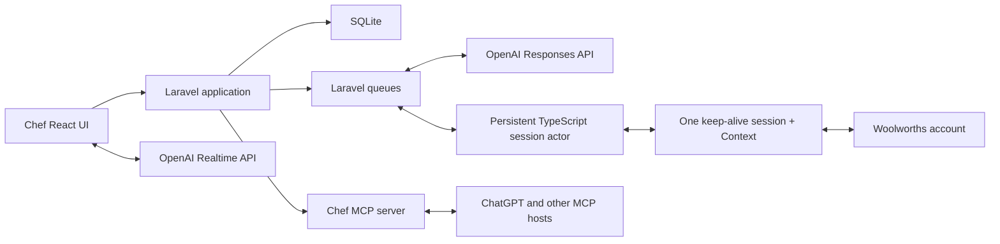

# Chef

Chef is a voice-first household meal-planning and grocery-management application.

The primary experience is a natural-language conversation: plan a week, explore ideas, negotiate preferences, adjust the budget, and ask the assistant to prepare an order. The application UI supports that conversation with durable structure and fast navigation when conversation is not the best interface—especially while reviewing the week, shopping, or cooking dinner.

Chef is not intended to be another recipe catalogue with an AI chat box attached. The household's plans, recipes, preferences, feedback, product choices, and order history are first-class application data. AI operates that model through explicit tools; it is not the system of record.

## Status

Milestones 0 through 5 are complete. The Laravel 13 web application under
[`web/`](web/) now supports authenticated family tenancy, a durable
conversational first plan, household people and attributed truth, versioned
recipes, complete arbitrary-span plans, direct plan controls, and private
testing feedback. Once every meal slot is resolved, the M4/M4.1 journey uses
one Sol/high structured generation job to turn all selected cookable meals into
durable recipe versions together. The one-shot input combines structured
household truth with the durable plan conversation so timing and nutrition
requests are not lost, then combines the recipe ingredients into a
traceable list and continues the same natural conversation for pantry,
household-item, quantity, and budget changes. One plan-level preparation and
retry state keeps manual ingredient entry out of the normal path. M5 adds a
Today surface, focused step-by-step cooking with durable progress and timers,
meal outcomes, person-specific feedback, and inspectable preference candidates
that can never become safety rules. The first M6 Woolworths cart-preparation slice is implemented behind disabled
release flags. Product direction moved the finish line from a human checkout
handoff to in-Chef fulfilment selection and confirmed order placement with the
retailer's default card on file; see
[`docs/plans/2026-07-22-retailer-order-placement-design.md`](docs/plans/2026-07-22-retailer-order-placement-design.md).
That M6.2 rewrite has landed for domain, shopping UI, and the Stagehand
retailer worker behind the same flags. Authenticated live trial evidence for
cart prep and confirmed submit remains open, so M6 and M6.2 are not complete.

The intended stack is:

- Laravel
- SQLite
- Inertia
- React and TypeScript
- Tailwind CSS
- shadcn/ui
- Pest
- Laravel AI SDK with the OpenAI provider for ordinary planning agents
- OpenAI Realtime API for native voice conversation
- Browserbase Contexts and recording-disabled sessions for Woolworths execution
- A thin TypeScript Stagehand/Playwright worker for deterministic retailer tools
- A remaining TypeScript session actor for owner Live View login, reauthentication, and takeover
- A future permissioned Chef Chrome extension behind the same browser-session contracts
- An MCP server exposing Chef's household, planning, recipe, shopping, and feedback capabilities

## Product thesis

Weekly food planning is not fundamentally a data-entry problem. It is a recurring household conversation:

- What do we feel like eating?
- What does everyone tolerate, dislike, or love?
- How much time and money do we have this week?
- What ingredients can be reused?
- What is already in the pantry?
- What did we cook recently?
- What needs to be ordered?
- What are we actually cooking tonight?

Chef should make that conversation enjoyable, remember its outcomes, and turn them into an executable plan.

## Household personas

Chef supports roles rather than assuming one permanent "meal planner."

### The planner

Usually plans several days at once, often through voice. They want inspiration without losing control of constraints, costs, or household preferences.

### The participant

Contributes preferences, rejects ideas, requests favourites, and may add household staples. They should not need to understand recipes or maintain structured data.

### The shopper

Needs one consolidated, editable list with quantities, preferred products, price context, substitutions, and a safe path to a placed supermarket order.

### The cook

Needs immediate access to tonight's meal, preparation warnings, ingredients, equipment, and readable step-by-step instructions. They should not have to reconstruct Sunday's planning conversation.

One person may occupy every role in a week. Different household members may also share them.

## Onboarding is the first meal plan

Onboarding should not feel like account administration followed by the real product. It should be the household's first planning conversation and the first useful thing they accomplish in Chef.

After the minimum account setup, Chef opens the same conversational workspace used for ordinary planning and says, in effect:

> Let's plan your first few meals. I'll learn what matters to your household as we go, and you can correct anything I remember.

The assistant gathers context naturally while building a real `MealPlan`. Structured controls—chips, meal cards, checkboxes, small forms, and the plan inspector—appear inside or beside the conversation only when they are faster than another message. The person can speak, type, skip a question, revise an earlier answer, or say that they do not know yet.

This approach has three benefits:

- the household receives value before onboarding is complete;
- the onboarding interaction teaches the normal Chef interaction model;
- preferences are learned in context rather than collected as an abstract questionnaire.

### What Chef needs to learn

Chef should progressively establish a baseline across five areas.

#### Household

- household and member names;
- default participants and approximate serving needs;
- timezone;
- which meals are normally planned;
- whether participation varies by day or meal.

Household size alone is insufficient. Participation and servings belong to each meal slot so a household can say, for example, that Thursday dinner is for one person while the rest of the plan is for two.

#### Safety and non-negotiables

- allergies and their severity;
- intolerances;
- religious, ethical, or medical restrictions;
- hard ingredient or meal exclusions;
- cross-contamination requirements where relevant.

Chef must clearly distinguish safety constraints from dislikes and soft preferences. It must never infer an allergy from rejected suggestions or meal feedback.

#### Taste baseline

- meals and cuisines the household loves;
- disliked meals, ingredients, textures, and preparation styles;
- preferred spice level;
- appetite for novelty versus familiar favourites;
- a few representative meals regularly cooked or ordered.

Rather than asking for exhaustive lists, Chef can show a small set of varied meal cards and ask the household to react. People can also paste a recipe URL, attach a screenshot, import a previous plan, or describe a typical week.

#### Cooking reality and goals

- realistic weeknight and weekend cooking time;
- cooking confidence and available equipment;
- willingness to prepare leftovers or repeat meals;
- whether leftovers should become lunches;
- expected eating-out nights;
- goals such as lower cost, higher protein, less waste, easier evenings, or greater variety;
- a default grocery budget range, with per-plan overrides.

#### Shopping preferences

- preferred retailer and fallback retailer;
- delivery, click-and-collect, or in-store preference;
- value, brand, pack-size, and substitution preferences;
- whether the household is willing to split a shop across retailers;
- common staples and products worth remembering.

### Progressive onboarding sequence

The first conversation should ask only enough to make safe, plausible recommendations:

1. Who are we planning for?
2. Are there any allergies, intolerances, or absolute exclusions?
3. What are several meals you genuinely enjoy?
4. What ingredients or meals should Chef avoid?
5. How much time is realistic on an ordinary evening?
6. How should leftovers and lunches work?
7. What grocery budget feels normal?
8. Where do you usually shop?

Chef then proposes a small first plan. The household's reactions provide further preference evidence, and the assistant can ask one contextual follow-up at a time. Before confirmation, Chef shows an editable summary of what it learned, explicitly separating safety rules, stated preferences, defaults, and tentative inferences.

Onboarding is therefore progressively complete rather than permanently blocking. Missing optional information can be collected when it becomes relevant in later plans.

### Onboarding interface

The onboarding experience uses the standard Chef shell:

- the conversation occupies the main workspace;
- a lightweight progress indicator communicates what remains without presenting a wizard;
- the right-hand inspector fills with household members, constraints, preferences, budget, shopping defaults, and the developing meal plan;
- interactive meal cards and quick-reaction controls make comparison fast;
- every remembered fact is editable or removable;
- the composer supports text, attachments, and voice;
- completion lands directly in the first plan rather than redirecting to an empty dashboard.

The experience must remain useful with typing alone. Voice is a first-class input, not a requirement.

### Permissions are requested just in time

Chef should explain each permission in plain language and ask only when the corresponding capability is first used:

- microphone access when the person first taps voice;
- notifications when enabling meal, preparation, shopping, or automation alerts;
- calendar read or write access when connecting schedules or creating reminders;
- camera or photo access when scanning a pantry, receipt, or recipe;
- retailer-tab access when preparing the first online cart;
- location only when it is needed to select a store or resolve delivery availability.

Every permission should have a visible status, scope, and revocation path. Declining an optional permission must preserve a manual alternative.

## The four-stage experience

The default household journey is intentionally momentum-first:

1. **Riff** on one complete, visible meal-plan proposal.
2. **Approve and prepare** with one clearly scoped action that confirms the plan and authorises Chef to prepare the connected retailer cart.
3. **Choose fulfilment and place** by resolving only genuine exceptions, choosing delivery or pickup, selecting an available day and time in Chef, confirming, and letting Chef submit the order with the retailer's default card on file.
4. **Cook** from the reconciled plan, products, preparation notices, and placed-order expectation.

Chef may maintain many durable preparation, matching, automation, and recovery
states internally. Those states do not become household steps by default. Safe,
reversible, and read-only work proceeds inside the approved scope; Chef
interrupts only when it needs new information, new authority, or a decision
whose consequence differs materially from what the household approved.

### 1. Plan — converse and explore

**Intent:** Decide what the household might eat over a date range.

The conversation is the primary interface. A person can say:

> Plan seven dinners for two people. Keep weeknights under 45 minutes, give us one slow-cooker meal, avoid recent repeats, and try to stay near $180.

Chef should bring relevant context into the conversation:

- household likes, dislikes, exclusions, and dietary requirements;
- recently cooked meals and prior ratings;
- time, budget, serving, and nutrition goals;
- pantry items and likely leftovers;
- reusable ingredients and preferred products;
- calendar constraints when explicitly connected.

The assistant should propose a coherent week, explain trade-offs, accept loosely worded changes, and avoid treating early ideas as commitments.

**Supporting UI:** A live week preview beside the conversation, showing draft meals, estimated cost, effort, repeated ingredients, and unresolved questions.

**Exit condition:** The household approves one visible meal-plan proposal and
authorises the stated preparation scope.

### 2. Review — make the week concrete

**Intent:** Turn an agreed direction into a reliable plan.

The application becomes more prominent here. People should be able to:

- scan the whole week;
- drag meals between days;
- adjust servings;
- mark eating out, leftovers, or an unplanned night;
- open the exact recipe version attached to a meal;
- see preparation requirements such as defrosting or marinating;
- identify ingredient overlap and likely waste;
- swap a meal conversationally or directly in the UI.

The UI is authoritative, while natural language remains available for broad changes such as "move the slow-cooker meal to Saturday and make Wednesday easier."

**Exit condition:** Every planned meal has a day, serving count, and usable recipe or explicit non-recipe status.

### 3. Shop — consolidate, budget, and order

**Intent:** Convert the plan into the products the household needs.

Chef should:

- aggregate and normalise recipe ingredients;
- subtract confirmed pantry stock;
- keep household staples alongside recipe-derived items;
- distinguish an ingredient requirement from a retailer product;
- remember preferred brands, pack sizes, and acceptable substitutes;
- estimate the order and compare it with the weekly budget;
- preserve actual order prices for historical reporting;
- prepare an online trolley through a retailer integration;
- present available delivery or pickup slots in Chef;
- after an explicit in-app confirmation, submit the retailer order using the account's default card on file.

Browser automation is a retailer adapter, not the source of truth. Chef owns the intended shopping list, the selected fulfilment slot, the confirmation boundary, and the recorded order result. The household chooses type, day, and time and confirms in Chef; Chef then places the order. Chef never stores card details and never submits without that confirmation.

**Supporting UI:** A source-attributed shopping list, budget summary, product matches, substitution preferences, pantry exclusions, fulfilment slot picker, order confirmation, and order-review state. Retailer-backed aisle grouping and rejected-product history arrive with catalogue discovery and reconciliation in the retailer order-placement work.

**Exit condition:** The shopping list is completed in store or reconciled with a reviewed retailer order.

### 4. Cook and learn — execute tonight, then improve

**Intent:** Make the plan useful at dinner time and improve the next plan.

The default screen should answer "what are we cooking tonight?" immediately. It should show:

- the meal and expected serving time;
- defrosting, marinating, or prep warnings;
- ingredients with quantities;
- equipment;
- large, sequential cooking steps;
- timers or concurrent tasks where useful;
- substitutions made during shopping;
- leftover and storage guidance.

Afterward, feedback should be lightweight and person-specific:

- cooked, skipped, replaced, or postponed;
- like, dislike, favourite, or neutral;
- what specifically worked or did not;
- whether the portion, effort, cost, and leftovers were appropriate;
- recipe adjustments to keep next time.

Feedback must update structured household knowledge rather than disappearing into chat history.

**Exit condition:** The meal outcome is recorded with as little or as much feedback as the household wants to provide.

## Experience principles

### Conversation first, UI when it is faster

Planning and changing intent should feel conversational. Comparing several days, checking a list, and following a recipe should feel visual and immediate.

### Household memory must be inspectable

People can see, correct, scope, or delete remembered preferences. Chef should distinguish explicit rules from inferred patterns and retain the evidence behind an inference.

### Preferences belong to people

Household consensus is not assumed. A meal can be loved by one person and merely tolerated by another. Hard exclusions, soft dislikes, favourites, and context-specific opinions are different concepts.

### Plans are date ranges, not just ISO weeks

The common case is a week, but the model should support weekends, partial weeks, holidays, and custom spans without inventing fake days.

### Ingredients are not supermarket products

"Chicken breast, 1 kg" is a culinary requirement. A specific Coles product, pack size, price, and substitution policy is a retail decision. Chef must model and reconcile both.

### External side effects are reviewable

Chef may propose changes and prepare carts. Sending orders, paying, deleting meaningful history, or sharing household data requires an explicit review or confirmation boundary.

### Recommendations should be explainable

Chef should be able to say why a meal was suggested: it fits the time available, uses an open ingredient, has not been cooked recently, suits both people, and keeps the projected shop within budget.

## Core domain model

The names are provisional, but the boundaries are intentional.

### Team, household, and people

- `Team`, presented as a family or household in the interface
- `User`
- `TeamMembership`
- `TeamInvitation`
- `Person`
- `UserPersonLink`
- `Preference`
- `PreferenceEvidence`

A team is Chef's tenancy and collaboration boundary. A user may belong to multiple teams, while a person may participate in meals and hold preferences without having an account. A preference may target an ingredient, recipe, meal, cuisine, retailer product, brand, preparation method, or freeform concept. It records strength, sentiment, provenance, confidence, and optional context.

### Planning

- `MealPlan` with `starts_on`, `ends_on`, lifecycle milestones, and a conversation thread
- `MealSlot` for a dated breakfast, lunch, dinner, snack, or custom occasion
- `PlannedMeal` with servings, status, notes, and an optional recipe version

A planned meal may represent a recipe, leftovers, takeaway, eating out, or an intentionally open slot.

### Recipes

- `Recipe`
- `RecipeVersion`
- `RecipeIngredient`
- `RecipeStep`
- `Ingredient`
- `Unit`

Recipe versions preserve what was actually planned and cooked even after the household improves the recipe.

### Pantry and shopping

- `PantryItem`
- `ShoppingList`
- `ShoppingListItem`
- `Retailer`
- `RetailProduct`
- `ProductMatch`
- `ProductPreference`

Shopping-list items retain their source: recipe requirement, staple, manual request, or assistant recommendation.

### Orders and budgets

- `Budget`
- `Order`
- `OrderLine`
- `OrderAdjustment`

Order lines store product descriptions, quantities, prices, substitutions, and retailer identifiers as historical snapshots. Past spending should never change because today's catalogue changed.

### Outcomes and learning

- `MealOutcome`
- `MealFeedback`
- `RecipeAdjustment`

Feedback belongs to a person and a specific meal occurrence. Chef may derive preference candidates from repeated outcomes, but inferred preferences remain distinguishable from explicit ones.

### Conversations, permissions, and automation

- `Conversation`
- `Message`
- `ConsentGrant`
- `AutomationRun`
- `AutomationRunItem`
- `AutomationStep`
- `AutomationIntervention`
- `RetailerConnection`
- `BrowserSession`
- `CartSnapshot`
- `CartSnapshotLine`

An automation run records its requested scope, exact shopping-list revision,
retailer connection, item outcomes, redacted audit steps, unresolved decisions,
and immutable final reconciliation. Screenshots remain transient inputs to the
next Responses call and are not retained as household history.

## Application architecture

Chef should remain one Laravel application rather than prematurely splitting into an API backend and detached SPA.

- Laravel owns authentication, authorisation, domain workflows, persistence, queues, and integrations.
- SQLite is the initial database and should remain viable for a personal or single-household installation.
- Inertia is the bridge between Laravel and React.
- React and shadcn/ui provide the conversational workspace, weekly planner, shopping review, and cooking mode.
- The OpenAI Responses API provides the primary planning, tool-use, and computer-use agent loop.
- The OpenAI Realtime API provides low-latency speech through WebRTC; Laravel creates the session or short-lived client credential so a permanent API key is never exposed to the browser.
- Server-sent events or WebSockets stream assistant and automation progress without making the entire application a detached client-side API product.
- Browserbase supplies one persistent Context and at most one active keep-alive session per Woolworths connection. Initial authentication, reauthentication, deterministic preparation, and takeover transfer exclusive control of that same session wherever it remains safe and available.
- One in-repo TypeScript actor connects once to Laravel's transient CDP URL, retains the Playwright connection, and accepts fenced, bounded commands through `chef.browser.actor.v1` internal RPC.
- The actor is an executor, not a policy authority: it has no database access and never receives the permanent OpenAI key.
- A future Chrome extension can implement the same executor boundary for a user-approved local retailer tab.
- Domain actions should be reusable from HTTP controllers, queued jobs, console commands, and MCP tools.



The architectural boundary is intentional:

- Chef's domain determines what the household intends to plan, buy, cook, and remember.
- OpenAI models reason about the next useful action and invoke explicit Chef or computer tools.
- The execution harness supplies tightly scoped screenshots, mouse, keyboard, and browser actions.

The model does not directly control a person's computer. It returns actions for Chef's harness to validate and execute.

### Browser execution

The first execution surface is Browserbase, offered just in time after the
shopping list is ready. The connection owner enters passwords and MFA through
a writable Live View while no model is attached. The session has persistence
enabled, recording disabled, an Australian region and proxy, and one Context
for that Woolworths login. Chef stores only the encrypted Context identifier;
credentials, cookies, CDP URLs, Live View URLs, screenshots, address history,
and payment data are not stored.

Each connection holds an exclusive lease so no two Browserbase sessions can use
the same Context concurrently. The first recording-disabled login session is
retained for the approved run, and one fenced actor keeps its Playwright/CDP
connection open across bounded commands. Human login or takeover yields
exclusive control without starting a second session. Actor loss first reconnects
to the keep-alive session; session loss restores the Context into a new session,
then authenticates and reconciles the real cart before any mutation. A
future local Chrome extension can implement the same `ComputerExecutor`
contract without changing run creation, policy, or reconciliation actions.

### Retailer order lifecycle

When a household approves a shopping list for retailer preparation:

1. Chef performs bounded read-only catalogue discovery before opening an authenticated cart run.
2. Chef shows exact products, genuinely ambiguous or unresolved choices, and applicable explicit household safety constraints. Strict constraints always require an explicit exact product.
3. The person resolves ambiguity and reviews the exact product plan and safety context; Chef freezes that plan with the shopping-list revision.
4. Laravel creates a scoped retailer order run and dispatches it to the dedicated `automation` queue.
5. Deterministic Playwright (with Stagehand recovery in the rewrite) prepares and visibly verifies each exact product.
6. Chef validates retailer actions against origin and risk policy.
7. The browser worker executes allowed tools in the Browserbase session and returns sanitised observations.
8. After the cart is verified, Chef scrapes available delivery or pickup options and presents them in structured UI.
9. The household selects fulfilment type, day, and time, then confirms that Chef may submit using the default card on file.
10. Chef applies the slot, submits the order, and records the retailer confirmation into durable order history.

Before the first mutation Chef inspects the actual Woolworths cart. A non-empty
cart always pauses for an explicit merge, replace, or cancel decision. Replace
is the only decision that authorises removal. Every mutation is followed by a
cart observation; a click without a verified product and quantity change is not
success.

The connection owner can pause an active run and take over the same
recording-disabled browser while the model is disconnected. Resume verifies
the protected cart, returns that session to agent control, and reconciles the
real cart before Chef attempts only missing work. A line changed after earlier
verification becomes an intervention rather than a successful final snapshot.
Human pauses do not consume the resumed run's active-processing allowance:
successful reauthentication, an explicit cart or item decision, and completed
manual takeover each renew that bounded processing window before work resumes.

Page content, retailer messages, advertisements, and on-screen instructions are untrusted input. They cannot expand an automation run's permission or override household intent.

### Approval boundaries

Chef may search and compare public catalogue products before authentication, but
the authenticated run starts only from a reviewed exact product plan. It may
then deterministically add and verify those products, using bounded semantic
browser recovery only for unfamiliar UI. It should pause immediately before:

- a material substitution outside the household's stated policy;
- exceeding the approved budget or tolerance;
- changing the selected store, delivery address, or account settings;
- transmitting sensitive personal information;
- responding to authentication, bot-detection, or suspicious instructions;
- selecting a fulfilment day or time without structured Chef UI choice;
- placing an order without an explicit in-Chef confirmation that names the
  fulfilment choice and that Chef will use the retailer's default card on file.

Card numbers and payment-instrument selection remain outside Chef. After the
household confirms in Chef, submitting the retailer order with the default
on-file payment method is an authorised agent action.

## OpenAI and MCP boundary

Chef is OpenAI-native: its own conversational interface uses the OpenAI Responses and Realtime APIs. The MCP server is an additional interface to the same Laravel domain actions, allowing a household to work with Chef from ChatGPT or another authorised MCP host. It is not a replacement for Chef or its system of record.

Initial MCP capabilities should be narrow and composable:

- inspect household context and preferences;
- inspect or create a meal plan;
- suggest, schedule, move, swap, or remove a meal;
- read recipes and cooking steps;
- generate and reconcile a shopping list;
- inspect budget and historical order context;
- record feedback and meal outcomes;
- prepare a retailer order through cart preparation, fulfilment selection, and confirmed submit;
- record the result of a placed order.

Tool responses should return stable identifiers and structured data so an assistant can continue a conversation without scraping the UI. Write tools should be explicit about their side effects and support idempotency where retries are plausible.

Essential household knowledge must never exist only inside OpenAI conversation state. Prompts and model calls operate on durable, inspectable Chef data, and every meaningful write returns stable domain identifiers.

## MVP

The first useful slice should support one family team, multiple collaborating users, and one team timezone. The tenancy model must allow a user to belong to multiple teams even if the first slice exercises only one.

### Included

- household members and explicit preferences;
- family invitations and attributed collaboration;
- conversational first-plan onboarding with an editable household summary;
- recipes, ingredients, steps, and recipe versions;
- arbitrary meal plans and dated dinner slots;
- native typed planning through the OpenAI Responses API;
- voice planning through the OpenAI Realtime API;
- weekly planner UI;
- "Tonight" cooking view;
- consolidated shopping list with manual items;
- estimated and actual order totals;
- meal feedback and recent-meal history;
- a reviewed Browserbase Woolworths path that prepares the cart, presents fulfilment options in Chef, and places the order after in-app confirmation, after its gated authenticated release evidence passes.

### Not initially included

- public recipe discovery or a social network;
- nutrition or medical advice;
- perfect pantry inventory automation;
- autonomous order submission without an explicit in-Chef confirmation;
- collecting, storing, or choosing among card details inside Chef;
- multi-retailer price optimisation;
- native mobile applications;
- complex real-time household collaboration;
- a marketplace of community recipes.

## Proposed delivery sequence

1. **Foundation** — Laravel, Inertia, React, shadcn/ui, SQLite, authentication, tenancy, quality gates, and the application shell.
2. **Conversational onboarding** — The first real meal plan, household people, explicit safety constraints, preferences, invitations, proposals, and an editable learning summary.
3. **Recipes and complete planning** — Recipe versions, imports, richer meal occasions, calendar and list views, revisions, and explainable recommendations.
4. **Shopping and budgets** — Ingredient aggregation, manual staples, pantry exclusions, product matches, list revisions, and order snapshots.
5. **Cooking and feedback** — Tonight view, preparation notices, steps, outcomes, and inspectable preference candidates.
6. **Retailer order placement** — Browserbase-first Woolworths cart preparation, fulfilment options in Chef, confirmed submit with the default card on file, reconciliation, and durable order evidence; Coles and the Chrome extension follow as adapters.
7. **Native voice** — Realtime WebRTC input and output over the same durable conversations and domain actions.
8. **MCP** — Read tools first, then reviewed planning, shopping, and feedback writes for external hosts.
9. **Public launch** — Operational, privacy, accessibility, security, recovery, and support gates for version 1.

## Product questions to resolve during discovery

- Does a household own recipes collectively, or can recipes remain personal and shared selectively?
- How should Chef represent disagreement between household members when ranking meals?
- Which inferred preferences are useful enough to surface without becoming intrusive?
- Is pantry stock manually confirmed, inferred from orders, or both?
- How much product matching should happen before the shopping phase opens for review?
- Which actions can an assistant take immediately, and which require staged confirmation?
- Which onboarding questions materially improve the first plan, and which should wait until context makes them relevant?
- Does an authorised authenticated Woolworths trial prove five-plus-item cart persistence and visibility in the ordinary app/site?
- What retailer terms, privacy controls, automation tolerance, and operating cost are acceptable for release?
- Which Chrome extension permissions would provide the narrowest reliable local-tab alternative later?
- What is the smallest useful recipe-import workflow?

## Repository layout

Chef is a monorepo so each client can share one product model without forcing the Laravel application to live at the repository root.

```text
web/                 Laravel, Inertia, and React application
web/automation/      TypeScript Stagehand retailer worker and Live View session actor
docs/                Product, architecture, milestones, and style
extensions/chrome/   Future permissioned retailer-tab executor
ios/                 Future native iOS client
android/             Future native Android client
marketing/           Astro public marketing site
```

`web/`, `docs/`, and `marketing/` are active today. Future clients should be
added when implementation begins rather than as empty placeholder directories.
Laravel remains the authoritative application and domain boundary; the Astro
site presents public product and editorial content without reimplementing
application behaviour. Native clients will use reviewed HTTP or Realtime
interfaces rather than reimplementing business rules.

Supporting documents:

- [Implementation guide](docs/IMPLEMENTATION.md)
- [Milestones to public version 1](docs/MILESTONES.md)
- [Product and interface style](docs/STYLE.md)
- [Brand identity and production assets](docs/BRAND.md)
- [Commercial and marketing strategy](docs/COMMERCIAL-STRATEGY.md)
- [Agent and contributor instructions](AGENTS.md)
