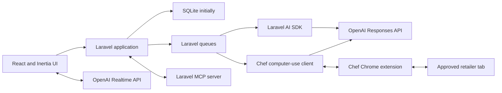

# Chef implementation guide

This document translates Chef's product thesis into an implementable architecture. The [README](../README.md) remains the product-level source of truth; this document owns technical boundaries, delivery shape, and implementation conventions.

## Current status

Milestones 0 through 4.1 are complete. The Laravel 13 React/Inertia application
in `web/` now provides authenticated family tenancy, durable arbitrary-span
plans and conversations, versioned recipes, streamed Laravel AI SDK responses,
authorised planning tools, direct calendar and list editing, plan revisions and
milestones, invitations, and responsive browser coverage without live OpenAI
calls in the test suite.

M3.1 hardens the real testing loop before cooking and shopping expand the
surface. Assistant-message and planning-checkpoint feedback remain distinct
from later person-specific meal feedback. Stated household preferences retain
exact human evidence; corrections supersede a wrong active record rather than
silently duplicating or deleting history. Plan readiness and next actions are
derived from structured state, and a successful tool-only turn must still
produce a visible acknowledgement.

M4 implemented the shopping-list domain. Shopping moved ahead of cooking in the
delivery order after real first-plan testing reached a confirmed plan and found
no executable next step. Subsequent testing exposed a missing boundary: Chef
could select ordinary cookable meals as title-only custom meals, after which
Shopping asked the household to supply their ingredients manually.

[M4.1](M4.1-PLAN-TO-SHOP-RELIABILITY.md) closes that boundary. Selecting a
cookable meal now prepares and retains a structured recipe version through a
Chef-owned Laravel AI SDK adapter and queued, idempotent application actions.
Plan readiness and shopping generation refuse unresolved cookable meals, while
the same plan conversation continues through shopping preparation and list
editing. The M4 list, revision, budget, catalogue, preference, and
historical-order capabilities remain the structured foundation. M5 can now
begin without weakening the recipe or shopping contracts.

## Technical stack

- Laravel 13
- PHP supported by Laravel 13
- SQLite for initial development and the first deployable slice
- Inertia
- React and TypeScript
- Tailwind CSS
- shadcn/ui
- Pest
- Laravel AI SDK using the OpenAI provider
- OpenAI Responses API for native computer use where the Laravel AI SDK does not expose the required protocol
- OpenAI Realtime API over WebRTC for voice
- Laravel queues for asynchronous agent and automation work
- Laravel broadcasting or server-sent events for streamed progress
- Laravel MCP for exposing reviewed Chef domain capabilities
- A permissioned Manifest V3 Chrome extension for local retailer-tab execution

SQLite must remain supported for personal and local installations. Before public launch, verify the expected concurrency and operational model; a hosted multi-team service will likely use PostgreSQL in production without changing the Eloquent domain model.

## Product language and tenancy

### Team is the tenancy boundary

The implementation model is `Team`. In the interface, a team is normally called a **family** or **household**.

A team owns:

- people and their household-scoped profiles;
- preferences and safety constraints;
- meal plans and conversations;
- recipes and recipe versions;
- pantry and shopping data;
- retailer preferences and product matches;
- orders, budgets, feedback, and automation runs.

A user may belong to multiple teams. Every team-owned query must be scoped by the active team, and every write must be authorised against a current `TeamMembership`.

### Users are not the same as people

`User` represents an authenticated account. `Person` represents someone who may participate in meals and have preferences.

Examples:

- an adult can be both a user and a person;
- a child can be a person without an account;
- a guest can be a temporary person on selected meal slots;
- one user can belong to more than one family team;
- a person can later be linked to an invited user without losing preference history.

Suggested identity models:

- `User`
- `Team`
- `TeamMembership` with `owner`, `admin`, and `member` roles
- `TeamInvitation`
- `Person`
- `UserPersonLink`

The initial permission policy can remain simple:

- owners manage the team, members, integrations, and deletion;
- admins manage members, preferences, plans, recipes, and shopping;
- members collaborate on plans, lists, cooking, and feedback.

Fine-grained custom roles are outside the first version unless real usage demonstrates a need.

## Domain boundaries

### Planning

- `MealPlan` is the durable workspace and thread for any date span.
- `MealSlot` represents a dated meal occasion.
- `MealSlotParticipant` records who is eating and optionally their serving requirement.
- `PlannedMeal` records the selected recipe, servings, status, and notes.
- `MealPlanRevision` records each meaningful structured change and supports optimistic revision checks.
- `MealPlanMilestone` records progress without forcing plans through one rigid linear state.
- A plan stores milestones such as planning confirmed, shopping list generated, shopping completed, cooking started, and review completed rather than relying on one rigid state enum.

Changing a confirmed plan marks its derived data stale with a human-readable reason. M4 attaches that signal to concrete shopping-list revisions and diffs.

### Preferences and safety

Preferences belong to people unless explicitly team-wide. Store:

- subject type and identifier;
- sentiment and strength;
- whether it is a hard constraint, explicit preference, or inference;
- evidence and provenance;
- confidence for inferred preferences;
- optional context such as breakfast-only or preparation method.

Allergies and other safety constraints are never inferred. They require an
explicit user-authored statement and remain visibly distinct from dislikes.
Conversational constraints retain a `confirmation_message_id`, and the
inspector shows that human-verifiable source. Direct structured edits record an
equivalent explicit confirmation event; an agent cannot self-certify safety by
supplying a boolean tool argument.

Conversational stated preferences retain `source_message_id` and the exact
supporting quote. Person-scoped writes must identify that person by name or by
an unambiguous immediate pronoun reference, and the preference subject must be
present in the quoted text. A correction records its user-authored correction
message, creates or updates the corrected active preference, and marks the
erroneous record as superseded. Superseded records remain available for audit
but are excluded from household truth and recommendation context.

### Recipes

Recipes are versioned. A `PlannedMeal` points to the exact `RecipeVersion` used when the meal was planned so later edits do not rewrite history. A selected version cannot be deleted while a plan retains it.

The implemented recipe records are:

- `Recipe` for the family-owned identity and current display metadata;
- `RecipeVersion` for an immutable cooking snapshot;
- `Ingredient` for the family-normalised culinary concept;
- `RecipeIngredient` for the versioned name, quantity, unit, preparation, optional state, and order;
- `RecipeStep`, `RecipeEquipment`, and `RecipePreparationNotice` for ordered cooking detail.

Direct forms, deterministic text import, and Chef tools all use `CreateRecipe`, `CreateRecipeVersion`, and `SelectPlannedMeal`. AI-created recipes carry a message-derived idempotency key so a replay cannot create duplicates. Recipe import does not fetch its source URL in M3; the URL is provenance only.

Ingredients and retailer products remain separate:

- `RecipeIngredient` expresses the versioned culinary need in M3; M4 derives normalised shopping requirements from it;
- `RetailProduct` expresses a retailer-specific product and pack;
- `ProductMatch` records how a requirement was satisfied for a particular list or order.

### Shopping and orders

`ShoppingListItem` is structured data even when edited through a lightweight document-like interface. It records quantity, unit, source meals, inclusion state, pantry status, preferred product, substitution policy, estimated price, and eventual order line.

M4 uses one `ShoppingList` per confirmed `MealPlan`.
`ShoppingListItemSource` retains the exact planned meal and recipe ingredient
behind every generated quantity, while `ShoppingListRevision` stores a durable
snapshot after each mutation. Compatible units are normalised before
aggregation and quantities are scaled from recipe servings to planned
servings. Manual and staple rows have no invented recipe source. Under M4.1,
ordinary cookable meals selected from Chef proposals or named by the household
must be materialised as versioned recipes before Plan review finishes. Explicit
takeaway, eating-out, open, and linked-leftover states remain non-recipe meals.
`ShoppingListMealResolution` remains a traceable recovery path for exceptional
or failed preparation, not the default household workflow.

Regeneration replaces recipe-derived rows but preserves manual and staple rows.
Any later plan revision marks the list stale with the same human-readable
change summary and a structured revision diff; stale rows are read-only until
regeneration.

`Retailer` and `RetailProduct` describe the catalogue side of the boundary.
`ProductMatch` connects a list requirement to a selected pack without changing
the culinary ingredient, while `ProductPreference` retains household brand,
pack, maximum-price, and substitution choices for later lists. Matching is
manual and deterministic in M4; retailer discovery and computer use remain M6.

`Budget` records a household default or a plan-specific override. The Shopping
workspace compares the effective budget with the known matched-product subtotal
and states how many items remain unpriced rather than presenting a partial total
as complete. `Order` and `OrderLine` freeze the list revision, catalogue product
description, matched price, and estimated line total, while `Order` retains the
user-entered actual overall total. M6 reconciliation records actual retailer
products, line prices, and substitutions when that evidence exists.
There are no update or delete routes for historical order snapshots.

Freeze a shopping-list revision before starting retailer automation. Record reconciled products and prices as immutable order snapshots rather than rewriting the M4 estimate.

### Conversations

Chef owns `Conversation` and `Message`. A conversation normally belongs to a `MealPlan`, but onboarding may create both together.

User turns are keyed by `(conversation_id, client_message_id)`. A turn records
pending, processing, completed, or failed response state, and its assistant
message points back through a unique `in_reply_to_message_id`. Replaying a
completed client turn returns the durable response; a stale or failed turn may
be retried; an active turn cannot be claimed twice.

Messages may reference structured artifacts such as:

- a draft meal proposal;
- a plan change set;
- a shopping-list revision;
- an approval request;
- an automation result;
- a preference summary.

Do not hide durable application state inside model conversation history.

`ConversationFeedback` records testing feedback separately from household and
meal feedback. It may refer to one assistant message or to a named workflow
checkpoint. It retains the responding user, team, conversation, plan and
revision, current milestone, rating, optional reason tags and comment, and the
agent invocation identifier when available. Feedback is visible only to its
author in the household interface and never mutates prompts or preferences
automatically.

Every planning tool that changes slot state returns a server-derived
`plan_progress` summary. When all slots have participants and selected meals
and no proposal remains unresolved, the next action is `review_and_confirm`.
Selecting the last meal does not itself confirm the plan. Explicit confirmation
records the planning milestone, after which shopping is the next product step.

The Laravel AI engine synthesises a factual acknowledgement from recorded plan
revisions or household-truth writes when a tool loop finishes without text. If
there is neither visible text nor a verifiable structured mutation, the turn is
failed and remains retryable; a blank completed assistant message is never
persisted.

## Application architecture

Chef remains a Laravel monolith with explicit internal boundaries. Do not split out services until a measured operational need appears.



Repository and application structure:

```text
web/
├── app/
│   ├── Actions/
│   │   ├── Teams/
│   │   ├── Planning/
│   │   ├── Recipes/
│   │   ├── Shopping/
│   │   ├── Cooking/
│   │   └── Automation/
│   ├── Ai/
│   │   ├── Agents/
│   │   ├── Tools/
│   │   └── Middleware/
│   ├── Domain/
│   ├── Http/
│   ├── Mcp/
│   ├── Models/
│   ├── Policies/
│   └── Providers/
└── resources/js/
    ├── components/
    ├── features/
    ├── layouts/
    ├── pages/
    └── types/
docs/
extensions/chrome/   # added when retailer automation begins
ios/                 # added when the native client begins
android/             # added when the native client begins
marketing/           # added when the Astro site begins
```

The root is the product repository, while `web/` is a self-contained Laravel
application with its own Composer and npm manifests. Do not create empty client
directories. Future native and marketing surfaces consume Chef's reviewed
interfaces; they do not become parallel sources of domain truth.

### Brand assets and tokens

The locked Shared Table identity is specified in `docs/BRAND.md`. Production SVG
masters and installable-app icons live under `web/public/brand` and `web/public`,
while active Tailwind/shadcn semantic tokens live in
`web/resources/css/app.css`. Feature components should consume semantic token
names instead of embedding palette hex values. Native and marketing clients
translate the same named roles into their platform formats.

Use action classes for meaningful domain mutations. HTTP controllers, AI tools, queued jobs, console commands, and MCP tools should call the same actions rather than duplicating business logic.

## Laravel AI SDK boundary

Use the Laravel AI SDK for Chef's normal server-side agent experience:

- `ChefAgent` instructions and orchestration;
- household and plan context;
- Laravel-native domain tools;
- structured meal proposals;
- typed-response streaming and broadcasting;
- queued agent work;
- agent middleware, events, observability, and tests.

The milestone 2 agent tools are deliberately narrow:

- `InspectTeamContext`
- `InspectMealPlan`
- `CreateHouseholdPerson`
- `UpdatePlanDateSpan`
- `CreatePlanMealSlot`
- `CreateMealProposal`
- `MoveSelectedMeal`
- `RecordHouseholdPreference`
- `RecordSafetyConstraint`

Recipe search, meal removal, shopping-list generation, and cart preparation are
added by their owning milestones rather than exposed before the underlying
domain actions exist.

Each tool delegates to an authorised domain action and returns stable identifiers plus concise structured results.

The SDK's conversation tables are not Chef's source of truth. Implement its conversational context from Chef's own `Conversation` and `Message` records, or add a small adapter if the SDK provides an appropriate conversation-store contract at implementation time.

Wrap the SDK behind a Chef-owned boundary so the pre-1.0 dependency can evolve:

```php
interface ChefConversationEngine
{
    public function respondTo(Conversation $conversation, Message $message): AssistantReply;

    /** @return iterable<AssistantStreamChunk> */
    public function streamResponse(Conversation $conversation, Message $message): iterable;
}
```

Retryable tool writes derive a stable database-unique idempotency key from the
current user message and the semantic operation. This covers meal slots, meal
proposals, preferences, and constraints. Person creation uses a unique
message-and-name identity, while moves and date updates are naturally
idempotent. Application lookups remain useful for fast replay, but uniqueness
constraints are the concurrency backstop.

## Voice boundary

The browser connects to the OpenAI Realtime API over WebRTC. Laravel creates the session or ephemeral credential using the server-held API key.

Realtime tool requests must call authenticated Chef endpoints or a server-side control channel that invokes the same domain actions as the typed agent. Persist the resulting user transcript, assistant response, tool actions, and structured artifacts into Chef's conversation model.

Voice is an input and response mode, not a separate product state. A plan started by typing can continue by voice and vice versa.

## Computer-use boundary

The Laravel AI SDK does not currently expose the complete OpenAI native computer-use protocol. Do not fork the SDK or inject unsupported provider payloads for the first version.

`StartCartPreparation` should create an `AutomationRun` and enqueue a dedicated workflow. A Chef-owned `ComputerUseEngine` calls the Responses API directly, handles `computer_call` and `computer_call_output`, validates every action, and communicates with the active Chrome extension.

```php
interface ComputerUseEngine
{
    public function advance(AutomationRun $run): ComputerUseStep;
}
```

The extension is only the local execution harness. It never receives the permanent OpenAI API key and does not decide the shopping policy.

Required automation properties:

- frozen input revision;
- idempotent resumable steps;
- explicit retailer and tab scope;
- allowlisted action types and origins;
- pause, cancel, expiry, and manual takeover;
- just-in-time approval for consequential actions;
- reconciliation of intended and actual products;
- checkout and payment always performed by the person.

## Collaboration

The first version needs collaborative data, not Google-Docs-level simultaneous editing.

- changes are persisted immediately and attributed to a user;
- broadcasts notify other active team members of plan, list, and automation changes;
- stale updates fail visibly or merge through version checks;
- assistant messages and structured artifacts appear consistently for every member;
- presence indicators and character-by-character co-editing are deferred.

Use optimistic UI only when rollback is clear. Prefer server-authoritative plan revisions for drag-and-drop scheduling and shopping-list edits.

## Permissions and privacy

- Authorise every team-owned resource through policies.
- Never trust a `team_id` supplied by the client without membership validation.
- Keep permanent OpenAI credentials server-side.
- Treat web pages and screenshots as untrusted input.
- Store the minimum screenshots needed for debugging and approvals; use an explicit short retention period.
- Record the purpose, scope, grant time, and revocation of browser, microphone, notification, calendar, camera, and location consent.
- Provide manual alternatives when optional permissions are declined.
- Never infer allergies or silently weaken a safety constraint.

## Testing strategy

The minimum implementation gate for a feature is:

1. domain tests for actions and invariants;
2. policy tests proving cross-team isolation;
3. request or Inertia tests for server contracts;
4. React component tests where client behaviour is non-trivial;
5. Laravel AI SDK fakes for prompts and ordinary tools;
6. recorded fixtures or a fake engine for computer-use continuations;
7. a focused browser test for the completed user journey;
8. formatting, static analysis, frontend type checking, and production builds.

Do not make ordinary test runs depend on live OpenAI calls or a live supermarket.

## First vertical slice

The first slice proves the product thesis, not the full shopping pipeline.

1. A user registers.
2. Chef creates a team and links the user to a person.
3. The conversational onboarding asks for participants, safety constraints, examples, dislikes, time, leftovers, budget, and retailer only as needed.
4. The assistant proposes three to seven dated meal slots using structured output.
5. The plan inspector fills as the conversation proceeds.
6. The user accepts, rejects, moves, or replaces meals through either chat or direct UI.
7. Chef shows an editable summary of what it learned.
8. The plan and conversation survive a new session.
9. An invited second user can view and make an attributed plan change.

The slice is complete only when this journey works through the real UI with persisted data and deterministic automated tests.

## Deferred decisions

- production database and hosting topology;
- exact Laravel authentication starter kit;
- Reverb versus SSE for each stream;
- direct retailer APIs if they become available;
- managed cloud browser support;
- native mobile applications;
- advanced concurrent editing;
- nutrition-provider selection and medical-data boundaries.
