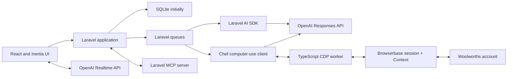

# Chef implementation guide

This document translates Chef's product thesis into an implementable architecture. The [README](../README.md) remains the product-level source of truth; this document owns technical boundaries, delivery shape, and implementation conventions.

## Current status

Milestones 0 through 5 are complete. The Laravel 13 React/Inertia application
in `web/` now provides authenticated family tenancy, durable arbitrary-span
plans and conversations, versioned recipes, streamed Laravel AI SDK responses,
authorised planning tools, direct calendar and list editing, plan revisions and
milestones, invitations, and responsive browser coverage without live OpenAI
calls in the test suite.

M3.1 hardens the real testing loop before cooking and shopping expand the
surface. Assistant-message and planning-checkpoint feedback remain distinct
from later person-specific meal feedback. Stated household preferences retain
exact human evidence; corrections supersede a wrong active record rather than
silently duplicating or deleting history. Plan readiness and next actions are
derived from structured state, and a successful tool-only turn must still
produce a visible acknowledgement.

M4 implemented the shopping-list domain. Shopping moved ahead of cooking in the
delivery order after real first-plan testing reached a confirmed plan and found
no executable next step. Subsequent testing exposed a missing boundary: Chef
could select ordinary cookable meals as title-only custom meals, after which
Shopping asked the household to supply their ingredients manually.

[M4.1](M4.1-PLAN-TO-SHOP-RELIABILITY.md) closes that boundary. Selection only
establishes the authoritative meal plan. Once every slot is filled and every
proposal is resolved, one plan-level queued action sends the entire selected
week to a Chef-owned Laravel AI SDK structured-output adapter. The workload is
pinned to OpenAI `gpt-5.6-sol` with high reasoning and returns every recipe,
including titles, ingredients, steps, equipment, notices, and storage guidance,
in one response. The input includes structured household and participant truth
plus a bounded snapshot of the durable plan conversation, so plan-level timing,
nutrition, ingredient, and variety requests remain available even when they are
not household preferences. Later chat is excluded from the structural
fingerprint and cannot invalidate a running batch. Chef validates exact-once planned-meal coverage before saving
any immutable recipe version. Plan readiness and shopping generation refuse
unresolved cookable meals, while the same plan conversation continues through
shopping preparation and list editing. The M4 list, revision, budget, catalogue, preference, and
historical-order capabilities remain the structured foundation. M5 builds on
the recipe and shopping contracts without weakening them.

M5 adds the Cook and learn boundary. Today resolves the family timezone and
shows the current day's planned meals, falling forward to the next planned meal
when today is empty. Recipe-backed meals open a focused cooking surface with
durable step progress, preparation notices, equipment, ingredients, ordered
products and substitutions, storage guidance, session-persistent timers,
screen-wake support, and an optional fullscreen mode. Non-recipe meals retain a
direct outcome path without invented cooking instructions.

`MealOutcome` records one durable result per planned meal: cooked, cooked with
leftovers, skipped, postponed, replaced, or ate out. `MealFeedback` belongs to
one participant and one completed cooked outcome; portion, effort, cost,
leftovers, notes, and recipe adjustments remain attributed rather than becoming
household consensus. Two consistent ratings for the same recipe may create an
inspectable `PreferenceCandidate`. Candidates remain separate from preferences
until a household member accepts them, dismissed candidates do not affect later
recommendations, and accepting a candidate can create only an ordinary feedback
preference. The constraint write path is unavailable to this workflow, so meal
feedback can never infer an allergy or other safety rule.

M6 now has a Browserbase-first Woolworths implementation behind disabled
connection and cart-mutation flags. It adds team-scoped retailer connections,
frozen revision runs, item outcomes, sessions, interventions, audit steps, and
immutable cart snapshots; a queued Laravel engine; a direct Responses client;
and an in-repo TypeScript/Playwright executor. Cart creation now requires an
explicit product-and-safety preflight. Strict household constraints require a
validated Woolworths product-detail URL for every item and disable
substitutions; other unmatched items require a separate automatic-search
approval. Reconciled cart snapshots can seed immutable order lines after the
human completes checkout. Normal tests use provider,
executor, and Responses fakes. The authorised live Woolworths trial, retailer
and privacy review, operating-cost evidence, and proof that the resulting cart
appears in the normal Woolworths app/site remain release gates. M6 therefore
remains open.

## Technical stack

- Laravel 13
- PHP supported by Laravel 13
- SQLite for initial development and the first deployable slice
- Inertia
- React and TypeScript
- Tailwind CSS
- shadcn/ui
- Pest
- Laravel AI SDK using the OpenAI provider
- OpenAI Responses API for native computer use where the Laravel AI SDK does not expose the required protocol
- OpenAI Realtime API over WebRTC for voice
- Laravel queues for asynchronous agent and automation work
- Laravel broadcasting or server-sent events for streamed progress
- Laravel MCP for exposing reviewed Chef domain capabilities
- Browserbase Contexts with recording-disabled human sessions and opt-in local-only agent-session recording for the first Woolworths execution surface
- An in-repo TypeScript worker using Browserbase/Playwright dependencies behind `chef.browser.v1`
- A future permissioned Manifest V3 Chrome extension behind `ComputerExecutor`

SQLite must remain supported for personal and local installations. Before public launch, verify the expected concurrency and operational model; a hosted multi-team service will likely use PostgreSQL in production without changing the Eloquent domain model.

## Product language and tenancy

### Team is the tenancy boundary

The implementation model is `Team`. In the interface, a team is normally called a **family** or **household**.

A team owns:

- people and their household-scoped profiles;
- preferences and safety constraints;
- meal plans and conversations;
- recipes and recipe versions;
- pantry and shopping data;
- retailer preferences and product matches;
- orders, budgets, feedback, and automation runs.

A user may belong to multiple teams. Every team-owned query must be scoped by the active team, and every write must be authorised against a current `TeamMembership`.

### Users are not the same as people

`User` represents an authenticated account. `Person` represents someone who may participate in meals and have preferences.

Examples:

- an adult can be both a user and a person;
- a child can be a person without an account;
- a guest can be a temporary person on selected meal slots;
- one user can belong to more than one family team;
- a person can later be linked to an invited user without losing preference history.

Suggested identity models:

- `User`
- `Team`
- `TeamMembership` with `owner`, `admin`, and `member` roles
- `TeamInvitation`
- `Person`
- `UserPersonLink`

The initial permission policy can remain simple:

- owners manage the team, members, integrations, and deletion;
- admins manage members, preferences, plans, recipes, and shopping;
- members collaborate on plans, lists, cooking, and feedback.

Fine-grained custom roles are outside the first version unless real usage demonstrates a need.

## Domain boundaries

### Planning

- `MealPlan` is the durable workspace and thread for any date span.
- `MealSlot` represents a dated meal occasion.
- `MealSlotParticipant` records who is eating and optionally their serving requirement.
- `PlannedMeal` records the selected recipe, servings, status, and notes.
- `MealPlanRevision` records each meaningful structured change and supports optimistic revision checks.
- `MealPlanMilestone` records progress without forcing plans through one rigid linear state.
- A plan stores milestones such as planning confirmed, shopping list generated, shopping completed, cooking started, and review completed rather than relying on one rigid state enum.

Changing a confirmed plan marks its derived data stale with a human-readable reason. M4 attaches that signal to concrete shopping-list revisions and diffs.

### Preferences and safety

Preferences belong to people unless explicitly team-wide. Store:

- subject type and identifier;
- sentiment and strength;
- whether it is a hard constraint, explicit preference, or inference;
- evidence and provenance;
- confidence for inferred preferences;
- optional context such as breakfast-only or preparation method.

Allergies and other safety constraints are never inferred. They require an
explicit user-authored statement and remain visibly distinct from dislikes.
Conversational constraints retain a `confirmation_message_id`, and the
inspector shows that human-verifiable source. Direct structured edits record an
equivalent explicit confirmation event; an agent cannot self-certify safety by
supplying a boolean tool argument.

Conversational stated preferences retain `source_message_id` and the exact
supporting quote. Person-scoped writes must identify that person by name or by
an unambiguous immediate pronoun reference, and the preference subject must be
present in the quoted text. A correction records its user-authored correction
message, creates or updates the corrected active preference, and marks the
erroneous record as superseded. Superseded records remain available for audit
but are excluded from household truth and recommendation context.

### Recipes

Recipes are versioned. A `PlannedMeal` points to the exact `RecipeVersion` used when the meal was planned so later edits do not rewrite history. A selected version cannot be deleted while a plan retains it.

The implemented recipe records are:

- `Recipe` for the family-owned identity and current display metadata;
- `RecipeVersion` for an immutable cooking snapshot;
- `Ingredient` for the family-normalised culinary concept;
- `RecipeIngredient` for the versioned name, quantity, unit, preparation, optional state, and order;
- `RecipeStep`, `RecipeEquipment`, and `RecipePreparationNotice` for ordered cooking detail.

Direct forms, deterministic text import, and Chef tools all use `CreateRecipe`, `CreateRecipeVersion`, and `SelectPlannedMeal`. AI-created recipes carry a message-derived idempotency key so a replay cannot create duplicates. Recipe import does not fetch its source URL in M3; the URL is provenance only.

Ingredients and retailer products remain separate:

- `RecipeIngredient` expresses the versioned culinary need in M3; M4 derives normalised shopping requirements from it;
- `RetailProduct` expresses a retailer-specific product and pack;
- `ProductMatch` records how a requirement was satisfied for a particular list or order.

### Shopping and orders

`ShoppingListItem` is structured data even when edited through a lightweight document-like interface. It records quantity, unit, source meals, inclusion state, pantry status, preferred product, substitution policy, estimated price, and eventual order line.

M4 uses one `ShoppingList` per confirmed `MealPlan`.
`ShoppingListItemSource` retains the exact planned meal and recipe ingredient
behind recipe-derived quantities, while `ShoppingListRevision` stores a durable
snapshot after each mutation. The deterministic generator normalises compatible
units and scales quantities from recipe servings to planned servings. Every
item also retains a grocery category. Chef assigns the category deterministically
for recipe-derived and manual rows, the household can correct it, category
changes remain part of the list revision history, and regeneration preserves
corrections for matching generated requirements. Manual and staple rows have no
invented recipe source. Under M4.1, ordinary cookable meals selected from Chef
proposals or named by the household are collected until the plan is structurally
complete. One plan-owned fingerprint, status, attempt count, safe failure, and
queue job then materialise all missing recipe versions atomically from one
structured model response. A changed plan invalidates the response before any
version is attached. Explicit
takeaway, eating-out, open, and linked-leftover states remain non-recipe meals.
`ShoppingListMealResolution` remains a traceable recovery path for exceptional
or failed preparation, not the default household workflow.

Production shopping generation uses one structured Laravel AI SDK Responses
call over Chef's retained, scaled recipe requirements. The
`ShoppingListDrafter` contract receives complete meal metadata, explicit safety
constraints, and ephemeral requirements containing only a request-local ID,
name, normalised quantity and unit, optionality, and planned-meal ID. The model
may group compatible requirement IDs and choose a shopper-friendly name and
Chef category; it cannot invent quantities, optionality, source meals, or
ingredients. Chef validates exact-once requirement coverage and reconstructs
quantity, unit, optionality, ingredient IDs, planned-meal IDs, and exact
`recipe_ingredient_id` sources server-side. Both `plan_generated` and fallback
rows therefore retain the recipe provenance used to create them.

`ShoppingItemIdentity` is deliberately conservative. It normalises case,
spacing, punctuation, singular/plural forms, and a reviewed alias set while
keeping rice varieties, oils, tomato products, and fresh versus ground spices
distinct. Chef converts mass to grams, volume and Australian cooking measures
to millilitres, and count synonyms to `each`. Compatible sources sum;
incompatible dimensions retain exact source quantities but expose a null total.
Tap-water requirements are removed before drafting.

The workload is pinned through `OPENAI_SHOPPING_LIST_MODEL` (default
`gpt-5.6-sol`) and `OPENAI_SHOPPING_LIST_REASONING_EFFORT` (default `high`). Chef
pins the OpenAI provider explicitly and invokes it once outside the replacement
transaction. Unknown, duplicate, missing, empty, or unsafely grouped source IDs,
invalid categories, duplicate canonical identities, invented water, and
unreferenced meals invalidate the result. Provider and structured-output
failures are logged with safe identifiers and use the same ingredient-aware
deterministic consolidation without a second model call. Normal automated tests
keep that deterministic fallback as their default.

A confirmed plan stores a SHA-256 safety-context hash covering ordered
recipe-backed meals and versions, participant assignments, and applicable
explicit constraints. A missing or changed hash requires explicit plan review
and reconfirmation before shopping preparation. Constraint creation, editing,
and deletion invalidate affected current or upcoming confirmed plans; a
person-scoped constraint touches only plans that include that person. Recipe,
participant, plan revision, safety, and requirement fingerprints are rechecked
after drafting so a stale response can never replace current rows.

Shopping generation is a durable claimed workflow with pending, processing,
ready, and failed states, an expiring opaque claim token, attempt count,
requirement-context hash, safe failure detail, timestamps, and the last method.
The list is claimed transactionally before the external call, duplicate active
claims are rejected, and expired claims are recoverable. Only provider or
structured-output failures enter deterministic fallback; request, safety,
persistence, and fallback failures become retryable durable failures.

Regeneration replaces both `recipe` and `plan_generated` rows but preserves
manual, staple, and valid resolved-custom-meal rows. Category corrections are
restored first by exact source signature and then by canonical identity. A force
path is available through the authorised
`chef:shopping-list:regenerate` command; ordinary generation remains idempotent.
Any later plan revision marks the list stale with the same human-readable
change summary and a structured revision diff; stale rows are read-only until
regeneration.

`Retailer` and `RetailProduct` describe the catalogue side of the boundary.
`ProductMatch` connects a list requirement to a selected pack without changing
the culinary ingredient, while `ProductPreference` retains household brand,
pack, maximum-price, and substitution choices for later lists. Matching is
manual and deterministic in M4; retailer discovery and computer use remain M6.
An exact Woolworths match retains both its product-detail URL and parsed product
identifier. The URL host must match the selected retailer, so an arbitrary
external identifier cannot satisfy the strict-constraint preflight by itself.

`Budget` records a household default or a plan-specific override. The Shopping
workspace compares the effective budget with the known matched-product subtotal
and states how many items remain unpriced rather than presenting a partial total
as complete. `Order` and `OrderLine` freeze the list revision, catalogue product
description, matched price, and estimated line total, while `Order` retains the
user-entered actual overall total. M6 reconciliation records actual retailer
products, line prices, and substitutions when that evidence exists.
When an order cites a ready-for-review `CartSnapshot`, Chef verifies that its
frozen item structure still matches the completed list, inherits the cart's
retailer, and creates lines from the reconciled remote cart rather than
reconstructing them from catalogue guesses. Checkout and the actual total stay
human-entered.
There are no update or delete routes for historical order snapshots.

`RetailerConnection` is family-owned and has one `owner_user_id`. Only that
owner may authenticate, reauthenticate, or disconnect it. The Browserbase
Context ID uses Laravel's encrypted cast and is hidden from serialisation.
`BrowserSession` retains only the encrypted provider session identifier,
purpose, safe lifecycle state, region metadata, and whether recording was
enabled. CDP and Live View URLs are fetched transiently and never written to a
database, page history, audit step, or log payload. Human login,
reauthentication, and manual-takeover sessions are always recording-disabled.
For local diagnosis only, `BROWSERBASE_RECORD_LOCAL_CART_SESSIONS=true` records
new agent-controlled cart-preparation sessions. The default is false and the
provider ignores the flag outside the local application environment.
Browserbase sessions default to a `1024 × 768` viewport to reduce Live View
rendering and transfer work while retaining Woolworths' desktop layout. The
same configured dimensions are sent to OpenAI computer use so screenshot
coordinates and browser actions remain aligned.
Authentication, inspection, clearing, and item preparation reuse an already
open protected cart surface instead of reloading Woolworths between adjacent
worker commands. Optional empty-cart totals use a bounded lookup so the absence
of a total-specific selector cannot consume the whole worker timeout.
The owner-only authentication Live View grants clipboard read/write permission
to its iframe so the person can paste credentials or MFA values directly. That
permission is not granted to manual cart takeover or agent-controlled browser
surfaces, and Chef never reads, stores, or forwards the clipboard contents.

`AutomationRun` references the exact current `ShoppingListRevision` and copies
only included, non-pantry requirements into `AutomationRunItem` records. A
later list edit cannot mutate that frozen state. `AutomationStep` stores only a
redacted action and verified observation summary. `AutomationIntervention`
holds explicit merge/replace/cancel, reauthentication, substitution, price,
bot-detection, and sensitive-screen pauses. `CartSnapshot` and
`CartSnapshotLine` are immutable reconciliation records; merge-mode baseline
lines remain classified as pre-existing and do not count as Chef-added
quantity.

### Cooking, outcomes, and learning

`MealOutcome` is the durable cooking-session and result boundary for one
`PlannedMeal`. Starting a recipe-backed meal records the cooking-started plan
milestone and current recipe step idempotently. Completing or directly resolving
a meal records one of the supported outcome states plus only the context that
state needs, such as a replacement title, postponed date, or leftover servings.
An outcome with person feedback cannot later be changed into a non-cooked result
because that would orphan the evidence.

`MealFeedback` is unique per outcome and participating `Person`. Reusable domain
actions validate rating dimensions even when invoked outside HTTP. Recipe
feedback is accepted only for cooked or cooked-with-leftovers outcomes; skipped,
postponed, replaced, and ate-out results do not accidentally teach Chef about the
original recipe.

`PreferenceCandidate` stores repeated same-recipe feedback as a reviewable
inference with evidence identifiers, count, confidence, and pending, accepted,
or dismissed state. Editing feedback withdraws a pending candidate when the
repeated pattern no longer exists. Accepted candidates create or link an
ordinary `Preference` with feedback provenance, while conflicting explicit
preferences must be resolved directly. Recommendation explanations may cite
pending candidates as unconfirmed patterns and accepted candidates as reviewed
signals; dismissed candidates are excluded. No cooking or feedback action can
write `Constraint` records.

### Conversations

Chef owns `Conversation` and `Message`. A conversation normally belongs to a `MealPlan`, but onboarding may create both together.

User turns are keyed by `(conversation_id, client_message_id)`. A turn records
pending, processing, completed, or failed response state, and its assistant
message points back through a unique `in_reply_to_message_id`. Replaying a
completed client turn returns the durable response; a stale or failed turn may
be retried; an active turn cannot be claimed twice.

Each response claim increments a safe attempt counter. A failed attempt retains
a correlation identifier, classified failure code, retryability, and timestamp
in message metadata while the server log records the same identifier with the
exception class and request context. Prompts, credentials, household content,
and raw provider responses are not added to client-visible diagnostics. The
interface retries a failed turn with its original content and
`client_message_id`, so neither the user message nor successful tool writes are
duplicated. A concurrent retry reloads the durable response state instead of
inventing another local failure.

Chef wraps SDK tools with its own recoverable boundary. Correctable validation
and stale-identifier failures become structured tool results that let the agent
inspect current state and correct its call; authorization, provider, and system
failures still leave the tool loop. Any escaped tool-input failure is classified
as `tool_error` for the same safe retry path.

Messages may reference structured artifacts such as:

- a draft meal proposal;
- a plan change set;
- a shopping-list revision;
- an approval request;
- an automation result;
- a preference summary.

The planning transcript keeps one message-scroller provider per conversation,
opens saved work at the last meaningful user turn, and follows streamed output
only while the reader remains at the live edge. Each durable message is an
addressable row. Household-truth source controls use those stable message IDs
to return from structured facts to their human-authored evidence without
reloading or losing the conversation's scroll state; the target receives a
brief visual highlight and keyboard focus once it is visible. Conversations
that span household-local days insert non-anchoring labelled date rows.
Streaming and failed-response markers remain compact and transient so durable
messages and structured plan state stay primary.

Do not hide durable application state inside model conversation history.

`ConversationFeedback` records testing feedback separately from household and
meal feedback. It may refer to one assistant message or to a named workflow
checkpoint. It retains the responding user, team, conversation, plan and
revision, current milestone, rating, optional reason tags and comment, and the
agent invocation identifier when available. Feedback is visible only to its
author in the household interface and never mutates prompts or preferences
automatically.

Every planning tool that changes slot state returns a server-derived
`plan_progress` summary. When all slots have participants and selected meals
and no proposal remains unresolved, the next action is `review_and_confirm`.
Selecting the last meal does not itself confirm the plan. Explicit confirmation
records the planning milestone, after which shopping is the next product step.

The Laravel AI engine synthesises a factual acknowledgement from recorded plan
revisions, household-truth writes, or meal proposals when a tool loop finishes
without text. Proposal progress distinguishes open slots from uncovered slots:
a pending proposal is visible and reviewable but does not fill its slot. If
there is neither visible text nor a verifiable structured mutation, the turn is
failed, classified, and remains visibly retryable; a blank completed assistant
message is never persisted.

## Application architecture

Chef remains a Laravel monolith with explicit internal boundaries. Do not split out services until a measured operational need appears.



Repository and application structure:

```text
web/
├── app/
│   ├── Actions/
│   │   ├── Teams/
│   │   ├── Planning/
│   │   ├── Recipes/
│   │   ├── Shopping/
│   │   ├── Cooking/
│   │   └── Automation/
│   ├── Ai/
│   │   ├── Agents/
│   │   ├── Tools/
│   │   └── Middleware/
│   ├── Domain/
│   ├── Http/
│   ├── Mcp/
│   ├── Models/
│   ├── Policies/
│   └── Providers/
└── resources/js/
    ├── components/
    ├── features/
    ├── layouts/
    ├── pages/
    └── types/
docs/
extensions/chrome/   # added when retailer automation begins
web/automation/      # Browserbase CDP worker source; built to automation/dist
ios/                 # added when the native client begins
android/             # added when the native client begins
marketing/           # Astro public marketing site
```

The root is the product repository, while `web/` is a self-contained Laravel
application with its own Composer and npm manifests. Do not create empty client
directories. Future native and marketing surfaces consume Chef's reviewed
interfaces; they do not become parallel sources of domain truth.

### Brand assets and tokens

The locked Shared Table identity is specified in `docs/BRAND.md`. Production SVG
masters and installable-app icons live under `web/public/brand` and `web/public`,
while active Tailwind/shadcn semantic tokens live in
`web/resources/css/app.css`. Feature components should consume semantic token
names instead of embedding palette hex values. Native and marketing clients
translate the same named roles into their platform formats.

Use action classes for meaningful domain mutations. HTTP controllers, AI tools, queued jobs, console commands, and MCP tools should call the same actions rather than duplicating business logic.

## Laravel AI SDK boundary

Use the Laravel AI SDK for Chef's normal server-side agent experience:

- `ChefAgent` instructions and orchestration;
- household and plan context;
- Laravel-native domain tools;
- structured meal proposals;
- typed-response streaming and broadcasting;
- queued agent work;
- agent middleware, events, observability, and tests.

The milestone 2 agent tools are deliberately narrow:

- `InspectTeamContext`
- `InspectMealPlan`
- `CreateHouseholdPerson`
- `UpdatePlanDateSpan`
- `CreatePlanMealSlot`
- `CreateMealProposal`
- `MoveSelectedMeal`
- `RecordHouseholdPreference`
- `RecordSafetyConstraint`

Recipe search, meal removal, shopping-list generation, and cart preparation are
added by their owning milestones rather than exposed before the underlying
domain actions exist.

Each tool delegates to an authorised domain action and returns stable identifiers plus concise structured results.

The SDK's conversation tables are not Chef's source of truth. Implement its conversational context from Chef's own `Conversation` and `Message` records, or add a small adapter if the SDK provides an appropriate conversation-store contract at implementation time.

Wrap the SDK behind a Chef-owned boundary so the pre-1.0 dependency can evolve:

```php
interface ChefConversationEngine
{
    public function respondTo(Conversation $conversation, Message $message): AssistantReply;

    /** @return iterable<AssistantStreamChunk> */
    public function streamResponse(Conversation $conversation, Message $message): iterable;
}
```

Retryable tool writes derive a stable database-unique idempotency key from the
current user message and the semantic operation. This covers meal slots, meal
proposals, preferences, and constraints. Person creation uses a unique
message-and-name identity, while moves and date updates are naturally
idempotent. Application lookups remain useful for fast replay, but uniqueness
constraints are the concurrency backstop.

One conversational request that adds several shopping extras is one domain
mutation, not several independent tool writes. `AddPlanShoppingItems` validates
the complete batch before writing, records all new rows in one transaction and
one shopping-list revision, and derives per-item idempotency keys from the user
message. Replaying the same turn returns the existing rows without duplicating
items or revisions. A later retry also reconciles against existing normalised
item names, so it adds only anything missing after a legacy or interrupted
partial turn. Additions lock and merge onto the current list because they are
commutative; destructive or replacement edits continue to require an expected
revision.

OpenAI models may otherwise emit several function calls from one response. Chef
sets `parallel_tool_calls` to `false` for the OpenAI-backed mixed read/write
agent as a defence in depth, while batch tools still preserve the user's full
intent in a single call. Parallel execution is reserved for independently safe
read operations, not shared-list mutations. If a provider or stream fails after
a durable tool write, the conversation engine reconstructs a factual
acknowledgement from revisions created after the user message began and marks
the turn complete instead of showing a false failure.

## Voice boundary

The browser connects to the OpenAI Realtime API over WebRTC. Laravel creates the session or ephemeral credential using the server-held API key.

Realtime tool requests must call authenticated Chef endpoints or a server-side control channel that invokes the same domain actions as the typed agent. Persist the resulting user transcript, assistant response, tool actions, and structured artifacts into Chef's conversation model.

Voice is an input and response mode, not a separate product state. A plan started by typing can continue by voice and vice versa.

## Computer-use boundary

The Laravel AI SDK does not currently expose the complete OpenAI native computer-use protocol. Do not fork the SDK or inject unsupported provider payloads for the first version.

`StartCartPreparation` creates an `AutomationRun` only from the current,
non-stale revision after the connection owner explicitly reviews the durable
safety context and proposed product-search scope. Any allergy, medical,
dietary, or religious constraint blocks automatic product selection until every
included item has an approved exact retailer product; substitutions are frozen
off for that run. Other unmatched items require an independent automatic-search
approval. A unique job on the `automation` queue advances a bounded chunk. The
local `composer dev` process listens to `default`, `ai`, and `automation`;
deployments should operate a dedicated `automation` worker so retailer work
cannot starve ordinary application jobs. A
Chef-owned `ComputerUseEngine` calls the Responses API directly, handles
`computer_call` and `computer_call_output`, validates every action twice, and
communicates with the TypeScript `ComputerExecutor`.

```php
interface ComputerUseEngine
{
    public function advance(AutomationRun $run): AutomationAdvanceResult;
}
```

`BrowserSessionProvider` owns Context/session creation, transient Live View and
CDP lookup, session closure, and Context deletion. `RetailerCartAdapter` owns
deterministic Woolworths login probes, cart inspection, known controls, and
reconciliation. `ComputerUseClient` owns only the direct Responses protocol.
`ComputerExecutor` owns the versioned JSON-lines worker process. A
human-triggered authentication probe uses a shorter navigation and process
deadline than queued cart work. Provider or worker timeouts return as a
recoverable in-session retry before the web request deadline rather than
allowing PHP to terminate the request. These contracts leave Coles and a future
Chrome extension as later adapters rather than new domain workflows.

The worker connects only to a Laravel-supplied CDP URL, has no Chef database or
authorisation access, and never receives the OpenAI key. Screenshots remain in
memory only until the next Responses call. Laravel owns response continuation
IDs, run/action limits, state transitions, leases, intervention creation, and
redacted audit records.

Required automation properties:

- frozen input revision;
- idempotent resumable steps;
- explicit retailer, origin, Context, and session scope;
- allowlisted action types and origins;
- pause, cancel, expiry, and manual takeover;
- just-in-time approval for consequential actions;
- reconciliation of intended and actual products;
- checkout and payment always performed by the person.

Before mutation, every run performs a fresh protected-page authentication
probe and cart inspection. A non-empty cart always pauses for merge, explicit
replace, or cancel. Merge retains baseline lines separately; replace alone
permits known remove controls. Authentication loss closes the agent session and
preserves verified item outcomes before exposing a new owner-only Live View.
If Browserbase reports a deleted Context, Chef clears the encrypted reference,
marks the connection revoked, and requires a new owner login. A lost session is
expired with its lease released; the next queue checkpoint opens a fresh
session and inspects the actual cart before any further mutation. A lost Live
View is returned as expired rather than leaving the owner attached to a dead
session.
Every add or quantity action is followed by a remote-cart verification, and
the full run ends with an immutable reconciliation before the normal
Woolworths cart link is shown.

`php artisan chef:automation:status` reports whether Browserbase, OpenAI, the
compiled worker, feature flags, normal-app proof, and queue configuration are
ready without printing credentials. Initial persistent-login verification
closes the human session and waits for the configurable Browserbase Context
sync delay before marking the connection ready. When an active run is already
waiting for reauthentication, verification instead transfers that same
recording-disabled session to the run. This avoids a new Browserbase proxy and
Context-restore boundary after the owner has already proved the protected cart.

The connection owner may also pause an active run and take control through a
recording-disabled session. If local agent recording is active, Chef closes the
recorded agent session and opens a fresh unrecorded session before handing over
control. A run-level lock prevents the worker, cancellation, and human control
from overlapping. The model remains disconnected during takeover; finishing
checks the protected cart page, returns the same unrecorded session to agent
control, and queues a fresh inspection. If final reconciliation no longer
contains a previously verified item, Chef creates a cart-changed intervention
instead of presenting the cart as ready.

`AutomationRun.expires_at` bounds active browser processing rather than time a
person spends completing a required pause. Every authorised transition from
reauthentication, an existing-cart decision, an item decision, or manual
takeover back into queued work renews the configured run TTL. The resumed worker
still rechecks the current shopping-list revision and protected cart before any
further mutation.

## Collaboration

The first version needs collaborative data, not Google-Docs-level simultaneous editing.

- changes are persisted immediately and attributed to a user;
- broadcasts notify other active team members of plan, list, and automation changes;
- stale updates fail visibly or merge through version checks;
- assistant messages and structured artifacts appear consistently for every member;
- presence indicators and character-by-character co-editing are deferred.

Use optimistic UI only when rollback is clear. Prefer server-authoritative plan revisions for drag-and-drop scheduling and shopping-list edits.

## Permissions and privacy

- Authorise every team-owned resource through policies.
- Never trust a `team_id` supplied by the client without membership validation.
- Keep permanent OpenAI credentials server-side.
- Treat web pages and screenshots as untrusted input.
- Do not persist authenticated automation screenshots, Live View URLs, CDP URLs, credentials, MFA data, address history, or payment information.
- Record the purpose, scope, grant time, and revocation of browser, microphone, notification, calendar, camera, and location consent.
- Provide manual alternatives when optional permissions are declined.
- Never infer allergies or silently weaken a safety constraint.

## Testing strategy

The minimum implementation gate for a feature is:

1. domain tests for actions and invariants;
2. policy tests proving cross-team isolation;
3. request or Inertia tests for server contracts;
4. React component tests where client behaviour is non-trivial;
5. Laravel AI SDK fakes for prompts and ordinary tools;
6. recorded fixtures or a fake engine for computer-use continuations;
7. a focused browser test for the completed user journey;
8. formatting, static analysis, frontend type checking, and production builds.

Do not make ordinary test runs depend on live OpenAI calls or a live supermarket.

## First vertical slice

The first slice proves the product thesis, not the full shopping pipeline.

1. A user registers.
2. Chef creates a team and links the user to a person.
3. The conversational onboarding asks for participants, safety constraints, examples, dislikes, time, leftovers, budget, and retailer only as needed.
4. The assistant proposes three to seven dated meal slots using structured output.
5. The plan inspector fills as the conversation proceeds.
6. The user accepts, rejects, moves, or replaces meals through either chat or direct UI.
7. Chef shows an editable summary of what it learned.
8. The plan and conversation survive a new session.
9. An invited second user can view and make an attributed plan change.

The slice is complete only when this journey works through the real UI with persisted data and deterministic automated tests.

## Deferred decisions

- production database and hosting topology;
- exact Laravel authentication starter kit;
- Reverb versus SSE for each stream;
- direct retailer APIs if they become available;
- authenticated Woolworths live evidence and normal-app cart synchronisation;
- Coles retailer adapter;
- Chrome-extension executor as a local alternative;
- native mobile applications;
- advanced concurrent editing;
- nutrition-provider selection and medical-data boundaries.
