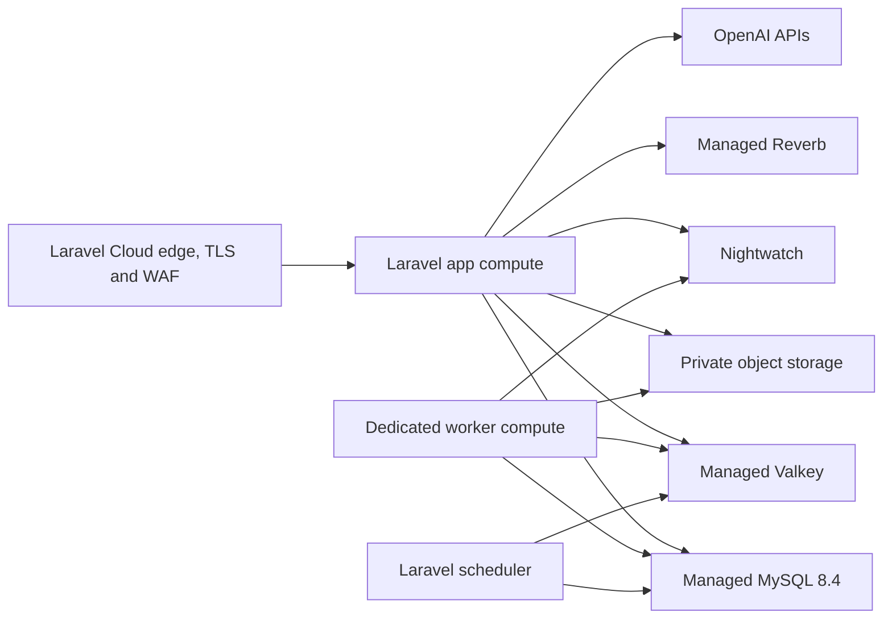

# Chef production topology and release runbook

Chef version 1 will run as one Laravel Cloud application in **Asia Pacific
(Sydney), `ap-southeast-2`**, with `web/` selected as the monorepo application
root. SQLite remains supported for local and personal installations; the hosted
multi-family service uses managed MySQL 8.4.

This is the production contract. Dashboard configuration is not release
evidence until the checks at the end of this document pass against the actual
environment.

## Topology



The choices follow Laravel Cloud's documented support for [monorepo application
roots](https://cloud.laravel.com/docs/monorepos), [Sydney
deployments](https://cloud.laravel.com/docs/applications), [worker
clusters](https://cloud.laravel.com/docs/queues), [scheduled
tasks](https://cloud.laravel.com/docs/scheduled-tasks), [private S3-compatible
object storage](https://cloud.laravel.com/docs/resources/object-storage), and
[managed Reverb](https://cloud.laravel.com/docs/resources/websockets).

## Environment shape

- Production does not hibernate. Automation expiry, queues, and scheduled
  retention work must continue while no household page is open.
- App compute starts with one replica. Scaling beyond one replica is allowed
  only after sessions, cache, maintenance mode, and scheduler locks are proven
  on Valkey.
- One dedicated worker runs:
  `php artisan queue:work redis --queue=automation,ai,default --sleep=1 --tries=3 --timeout=120 --max-time=3600`.
- The scheduler is enabled on the worker and invokes `schedule:run` each minute.
  Every non-duplicable scheduled task uses `onOneServer()`.
- Managed MySQL 8.4 has daily backups with 14-day retention. Create a manual
  snapshot before a schema migration or dependency release with data risk.
- Valkey backs queues, cache, session, rate limits, locks, and maintenance mode.
- The object-storage bucket is private. Automation screenshots use short-lived
  application-authorised access only and are deleted by the retention job.
- Managed Reverb starts at 100 concurrent connections. Polling remains a
  recovery path when a socket is unavailable.
- Nightwatch is enabled for app and worker compute. Laravel Cloud infrastructure
  and billing notifications go to the release owner and support mailbox.
- Production email uses a real transactional provider. `log` and `array` mail
  transports fail the release check.

The non-secret variable contract is in `web/.env.production.example`. Laravel
Cloud injects attached database, Valkey, bucket, and Reverb credentials. Keep
OpenAI, mail, Nightwatch, and support values in environment secrets. Never copy
production credentials into the repository.

## Build, deploy, and process settings

Select `web/` as the application root. Use PHP 8.4 and Node 22.

Build commands:

```shell
composer install --no-dev --prefer-dist --optimize-autoloader
npm ci
npm run build
php artisan config:cache
php artisan route:cache
php artisan view:cache
```

Deploy command:

```shell
php artisan migrate --force
```

Do not run `storage:link`, queue restarts, or cache-clearing commands during a
Cloud deploy. The runtime filesystem is ephemeral; durable private files belong
in object storage.

## Release verification

Run these from the deployed environment after every candidate deployment:

```shell
php artisan chef:release:check --probe
php artisan migrate:status
php artisan schedule:list
php artisan queue:monitor automation,ai,default --max=100
```

Then verify:

1. `/up` returns 200 for process health and `/ready` returns 200 for database
   and cache readiness.
2. A deliberately queued no-risk job is processed by worker compute.
3. A private team broadcast is received only by a current team member.
4. A temporary private object can be written, read, and deleted.
5. Nightwatch receives one web request and one queued job trace without message
   contents, screenshots, API keys, or retailer credentials.
6. The backup/restore drill in `RESTORE.md` has current evidence.

Record the environment, release SHA, operator, time, and evidence links in the
M8 launch record. A passing local command does not stand in for this deployed
proof.
